# vLLM-HybridAttn

Production-grade vLLM integration for [MiniCPM-SALA](https://huggingface.co/openbmb/MiniCPM-SALA) — OpenBMB 9B hybrid-attention language model combining Lightning Attention and InfLLM-V2 sparse attention.

[](#testing)
[](#repository-layout)
[](https://github.com/vllm-project/vllm)
[](LICENSE)

## Motivation

MiniCPM-SALA interleaves two attention mechanisms across 32 layers:

- **Lightning Attention** (75%) — O(1) gated linear attention
- **Sparse GQA** (25%) — InfLLM-V2 top-k block sparse past 8192 tokens

Integrating this into vLLM requires model code, optional sparse backends, custom KV cache specs, and scheduler wiring — delivered as **two independent upstream PRs**.

## Features

| Feature | PR | Status |
|---------|-----|--------|
| Hybrid layer schedule | PR1 | Verified (unit tests) |
| Lightning Attention kernels | PR1 | Verified (unit tests) |
| Dense GQA fallback (NoPE) | PR1 | Verified (unit tests) |
| Weight loading + registry | PR1 | Verified |
| InfLLM-V2 sparse backend | PR2 | Verified (unit tests) |
| Hierarchical KV cache spec | PR2 | Verified (unit tests) |
| HF logprob parity | PR1 | Pending |
| Ampere+ sparse e2e | PR2 | Pending |

## Architecture

Complete Mermaid diagram set (renders on GitHub). See also [docs/architecture.md](docs/architecture.md) and [docs/minicpm_sala_diagrams.md](docs/minicpm_sala_diagrams.md).

### Overall system

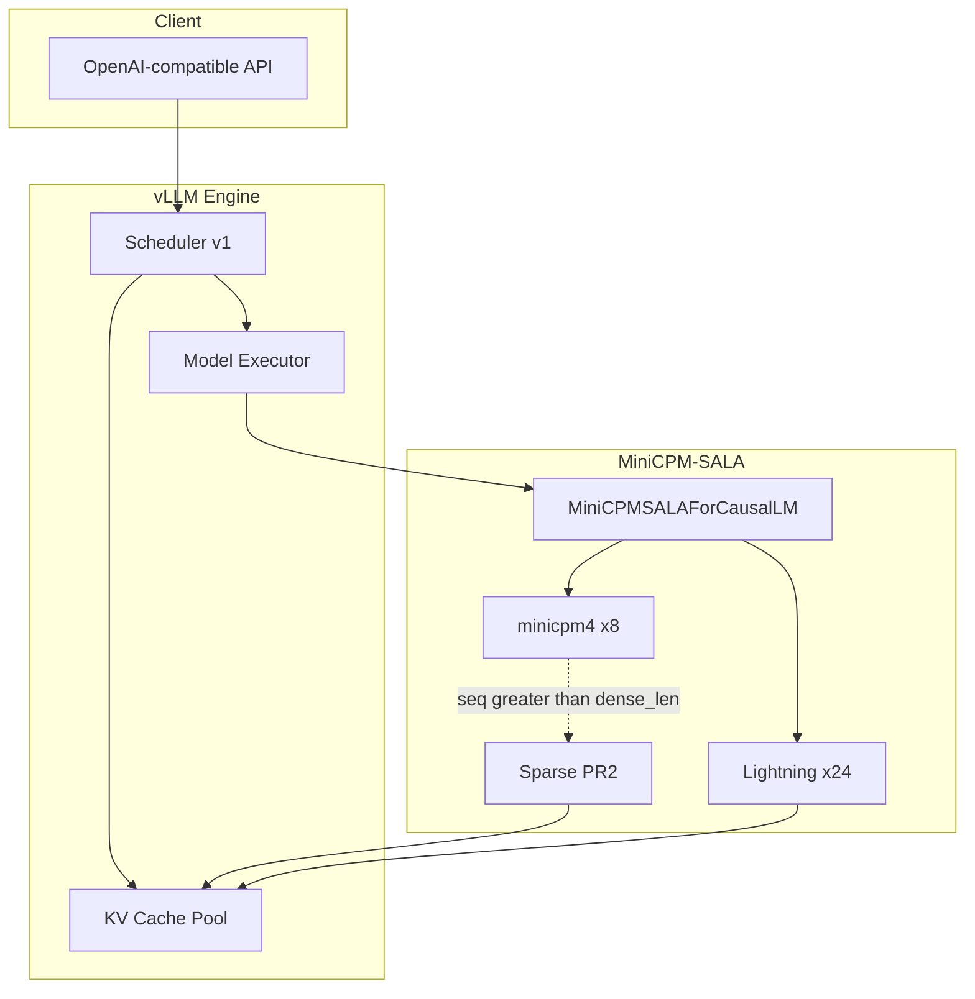

### Model hierarchy

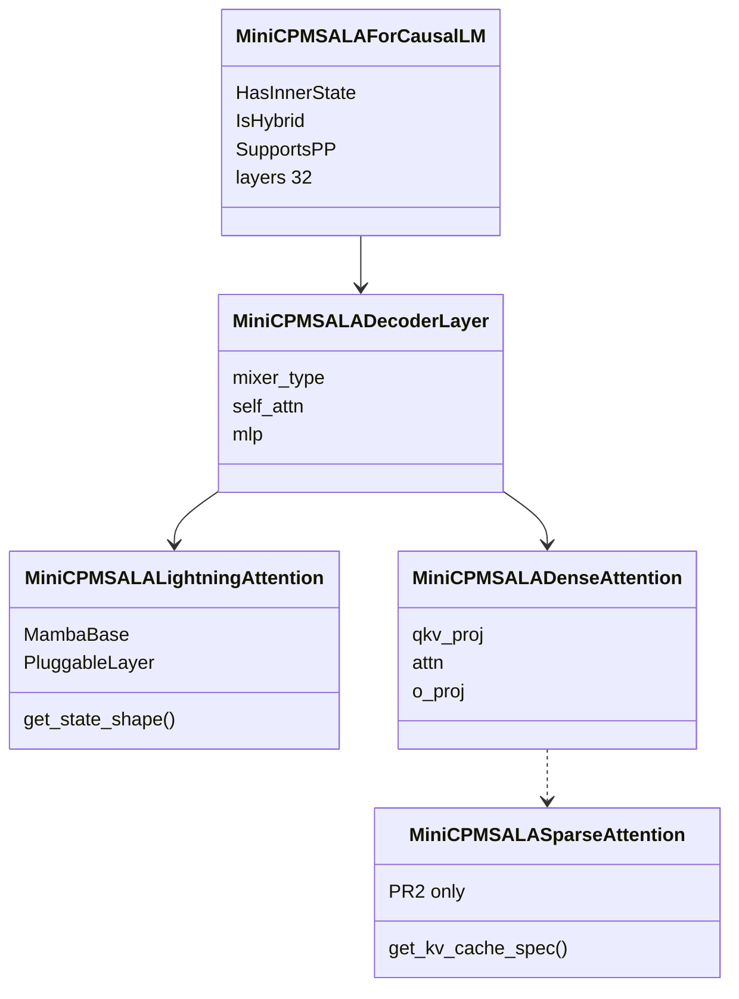

### Module dependency graph (PR1 / PR2 boundary)

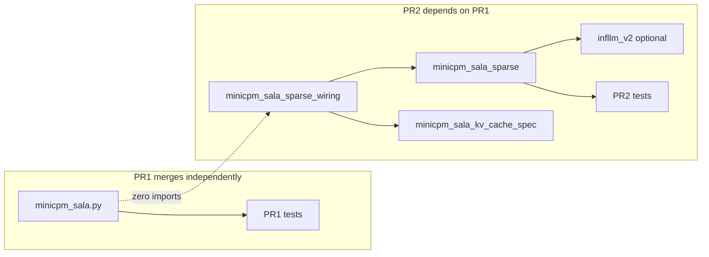

### Scheduler interaction

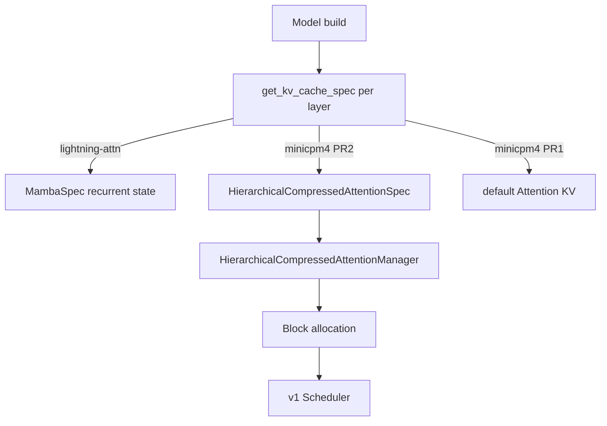

### Memory ownership

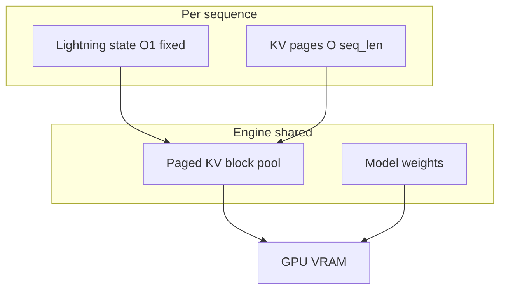

### Token generation flow

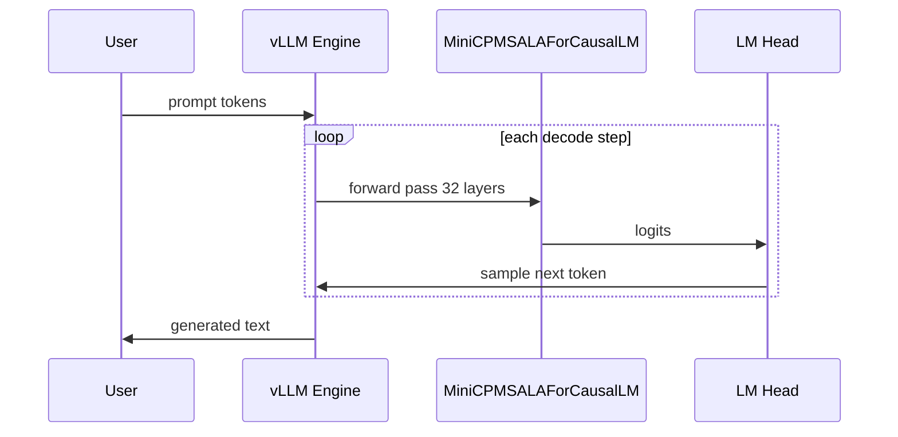

### Weight loading

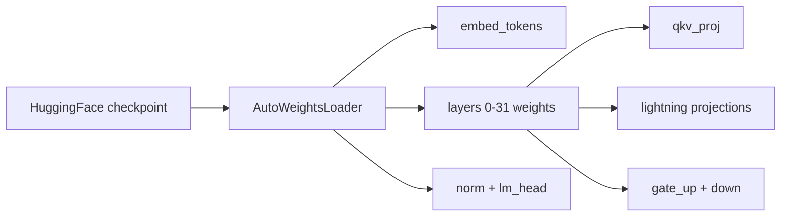

### Configuration loading

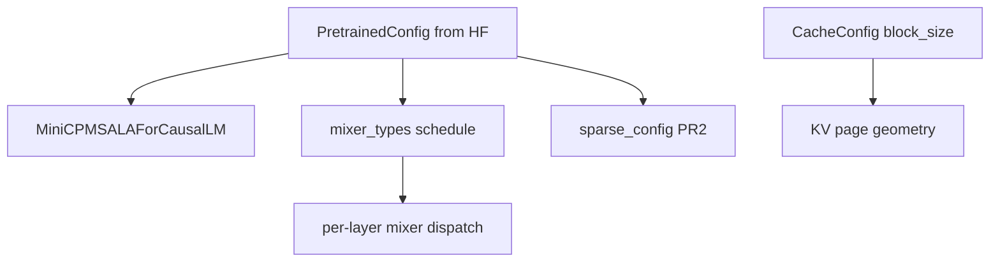

### GPU execution paths

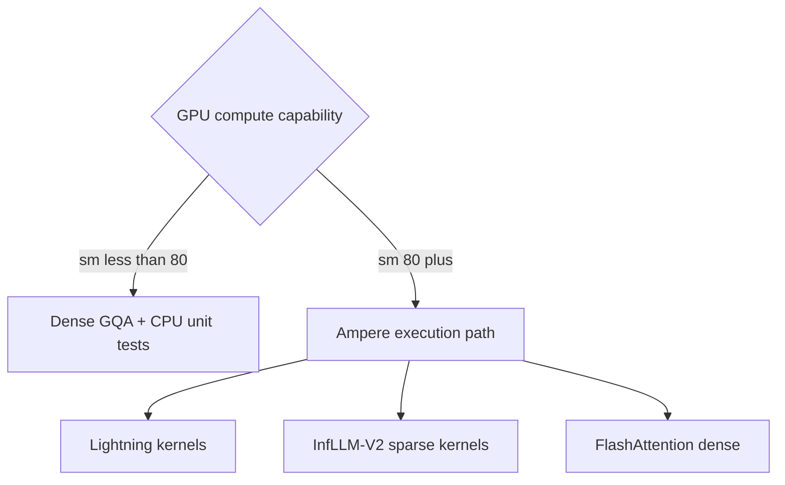

### Repository layout

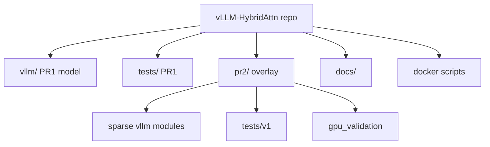

### Docker workflow

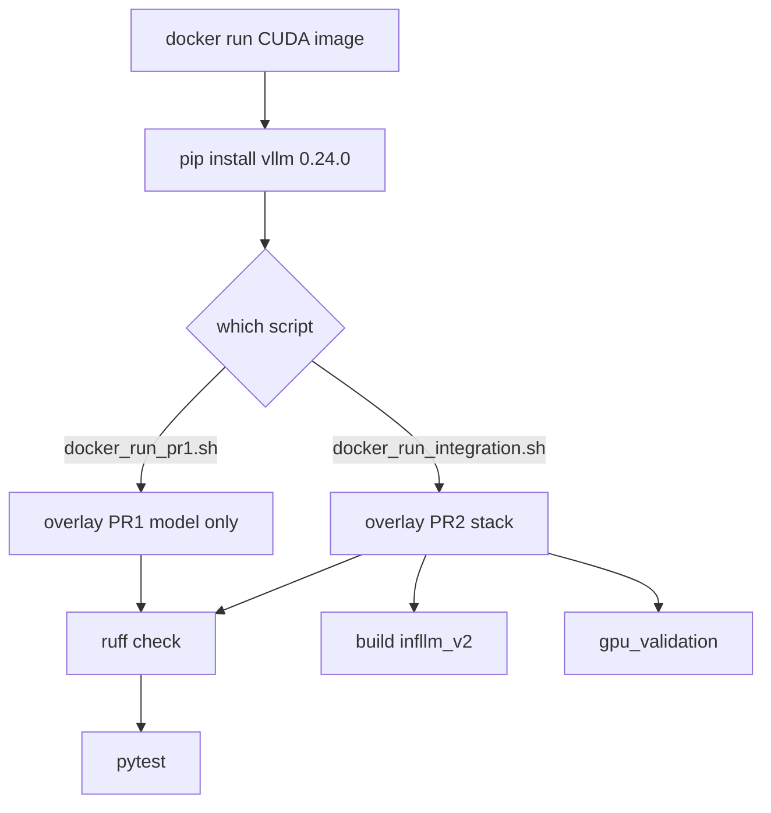

### Testing pipeline

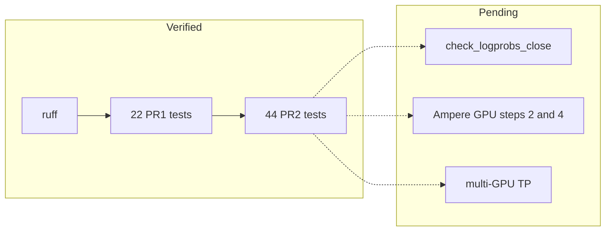

### CI pipeline

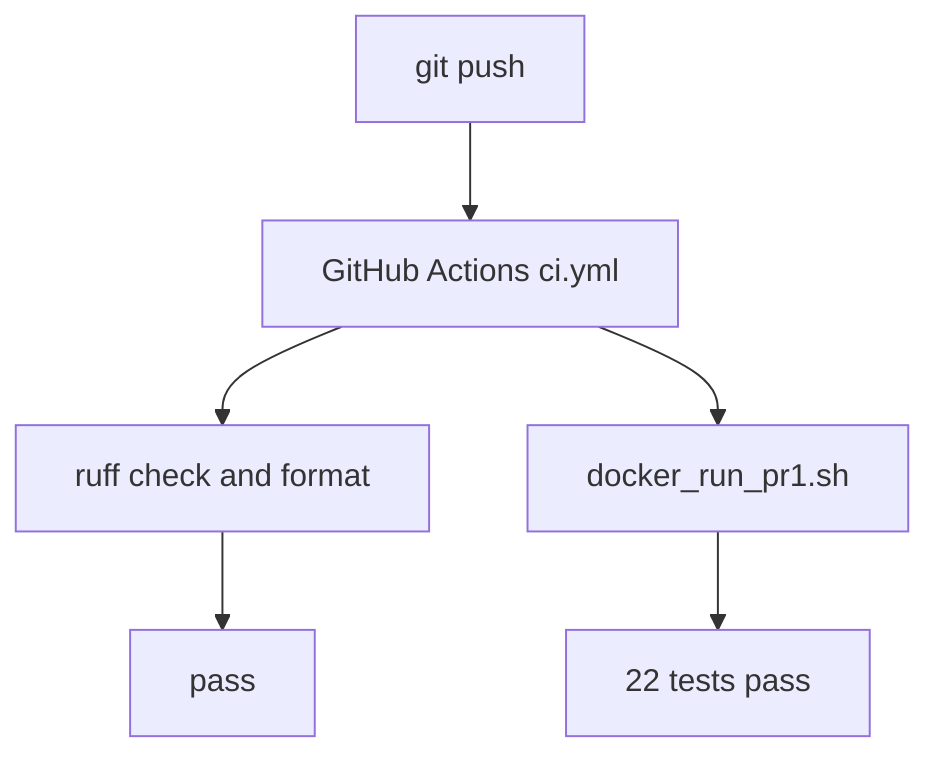

### Upstream PR workflow

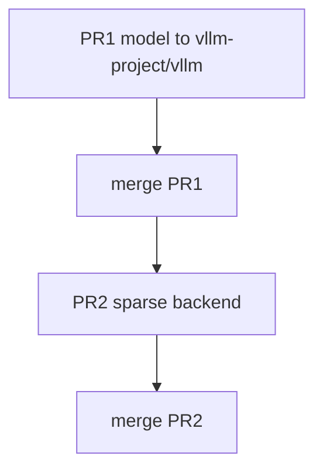

### Git branching strategy

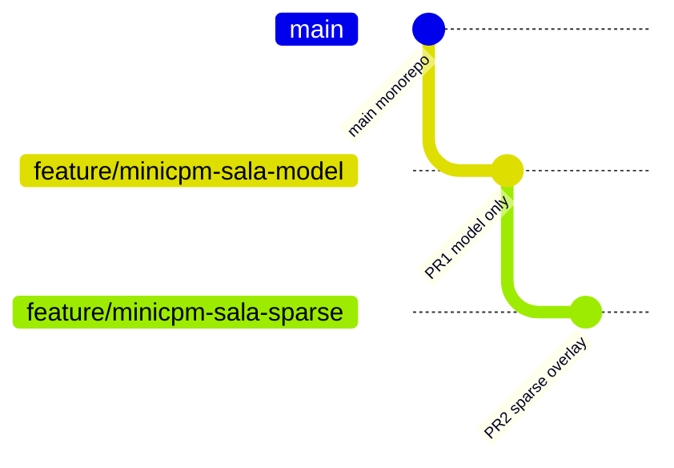

### From architecture.md

MiniCPM-SALA is a 32-layer hybrid model:

- **75%** `lightning-attn` layers — gated linear attention (O(1) state)
- **25%** `minicpm4` layers — GQA attention (dense or sparse past `dense_len`)

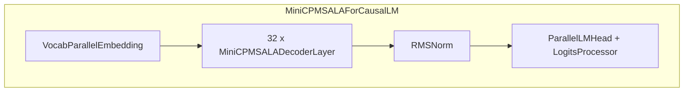

## Module responsibilities

| Module | PR | Responsibility |
|--------|-----|----------------|
| `minicpm_sala.py` | 1 | Model, dense attention, lightning attention, weight loading |
| `minicpm_sala_sparse_wiring.py` | 2 | Sparse `Attention` subclass + factory |
| `minicpm_sala_sparse.py` | 2 | `AttentionBackend`, metadata, InfLLM dispatch |
| `minicpm_sala_kv_cache_spec.py` | 2 | `HierarchicalCompressedAttentionSpec`, cache manager |

## Dependency graph

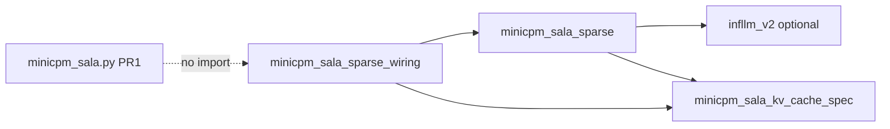

PR1 has **no edges** to PR2 modules.

## Layer forward pass

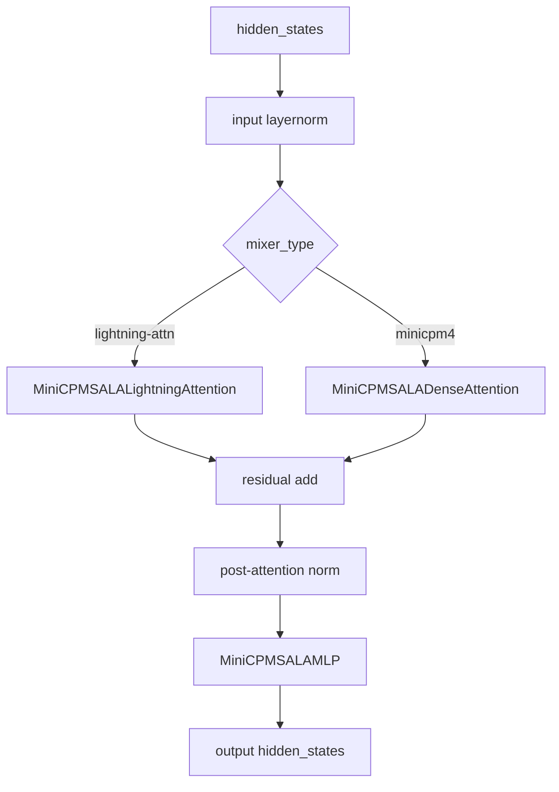

## Dense attention path (PR1)

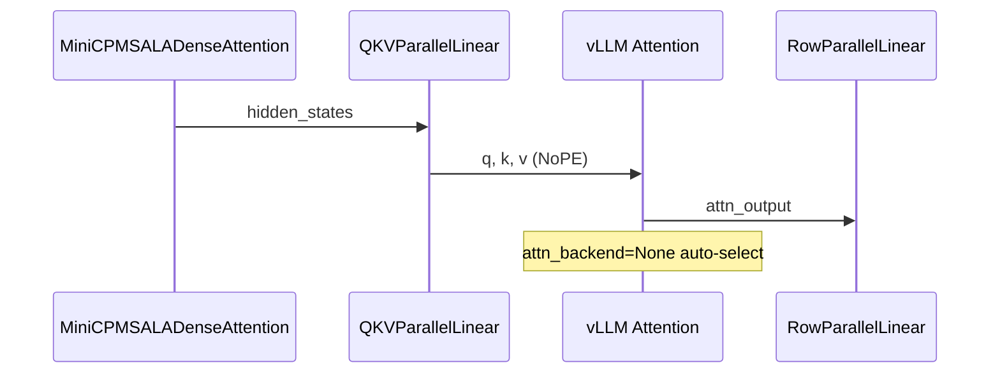

## Sparse attention path (PR2)

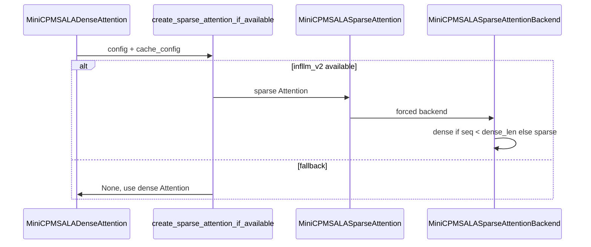

## KV cache lifecycle (PR2)

```mermaid
stateDiagram-v2
    [*] --> Prefill
    Prefill --> DenseRegion: seq_len <= dense_len
    Prefill --> SparseRegion: seq_len > dense_len
    DenseRegion --> Decode: standard paged KV
    SparseRegion --> Compress: CompressK kernel
    Compress --> TopK: infllm_v2 block selection
    TopK --> Decode
    Decode --> DenseRegion: per-sequence dispatch
    Decode --> SparseRegion: per-sequence dispatch
```

## Scheduler interaction (PR2)

`MiniCPMSALASparseAttention.get_kv_cache_spec()` returns
`HierarchicalCompressedAttentionSpec` so the vLLM v1 scheduler allocates
hierarchical compressed cache pages.

## Extension points

| vLLM extension | Usage |
|--------------|-------|
| `Attention(attn_backend=...)` | Force sparse backend (PR2) |
| `@register_kv_cache_spec` | Register hierarchical spec (PR2) |
| `MambaBase` / `PluggableLayer` | Lightning layer integration (PR1) |
| `HasInnerState` / `IsHybrid` | Scheduler hints (PR1) |

## Design decisions

1. **PR1/PR2 split** — model merges without sparse deps; sparse is optional overlay
2. **NoPE on minicpm4** — matches `attn_use_rope=false` in reference config
3. **Dense fallback** — exact reference behavior below `dense_len` (8192)
4. **infllm_v2 optional** — import-time detection, no hard dependency in PR1

## Tradeoffs

| Decision | Benefit | Cost |
|----------|---------|------|
| Reuse minimax linear attn kernels | Proven vLLM path | Coupling to mamba infra naming |
| Separate wiring module | Clean PR1 boundary | Extra file in PR2 |
| Hierarchical KV spec | Correct memory accounting | Custom cache manager complexity |

### From minicpm_sala_diagrams.md

### 

Per-layer mixer dispatch (the real 32-layer schedule)

Sparse ("minicpm4") layers in **bold**; every other layer is Lightning
Attention. Positions verified against real checkpoint weight names in
`known_limitations.md` §1a — this is not illustrative, it's the exact
schedule.

```mermaid
flowchart LR
    subgraph L["Layers 0\u201331"]
    direction LR
        L0["**L0**\nsparse"] --> L1["L1\nlight"] --> L2["L2\nlight"] --> L3["L3\nlight"]
        --> L4["L4\nlight"] --> L5["L5\nlight"] --> L6["L6\nlight"] --> L7["L7\nlight"]
        --> L8["L8\nlight"] --> L9["**L9**\nsparse"] --> L10["L10\nlight"] --> L11["L11\nlight"]
        --> L12["L12\nlight"] --> L13["L13\nlight"] --> L14["L14\nlight"] --> L15["L15\nlight"]
        --> L16["**L16**\nsparse"] --> L17["**L17**\nsparse"] --> L18["L18\nlight"] --> L19["L19\nlight"]
        --> L20["L20\nlight"] --> L21["L21\nlight"] --> L22["**L22**\nsparse"] --> L23["L23\nlight"]
        --> L24["L24\nlight"] --> L25["L25\nlight"] --> L26["L26\nlight"] --> L27["L27\nlight"]
        --> L28["L28\nlight"] --> L29["**L29**\nsparse"] --> L30["**L30**\nsparse"] --> L31["**L31**\nsparse"]
    end
    style L0 fill:#f96,stroke:#333
    style L9 fill:#f96,stroke:#333
    style L16 fill:#f96,stroke:#333
    style L17 fill:#f96,stroke:#333
    style L22 fill:#f96,stroke:#333
    style L29 fill:#f96,stroke:#333
    style L30 fill:#f96,stroke:#333
    style L31 fill:#f96,stroke:#333
```

8 sparse / 24 lightning = exactly 25%, matching the model card's "25%
InfLLM-V2, 75% Lightning Attention" claim — and note the clustering: three
consecutive sparse layers at the very end (29-31), which matters for
pipeline-parallel stage boundaries (a naive even split could put all
three sparse layers, the more compute-heavy ones per-token, in one PP
stage).

### One decoder layer's tensor flow (Stage 1 scope: dense-fallback sparse path)

```mermaid
flowchart TD
    IN["hidden_states\n(seq_len, 4096)"] --> RESID1["residual = hidden_states"]
    IN --> NORM1["input_layernorm\n(RMSNorm)"]
    NORM1 --> DISPATCH{"mixer_types[i]?"}

    DISPATCH -->|sparse| SPARSE["MiniCPMSALADenseAttention\n(vLLM Attention class,\nFullAttentionSpec, NoPE,\nGQA 16:1)"]
    DISPATCH -->|lightning| LIGHT["MiniCPMSALALightningAttention\n(gated linear attention,\nRoPE + qk_norm,\nno GQA, 32:32 heads)"]

    SPARSE --> ATTNOUT["attn_out\n(seq_len, 4096)"]
    LIGHT --> ATTNOUT

    RESID1 --> ADD1["hidden_states =\nresidual + attn_out \u00d7 (scale_depth/\u221a32)"]
    ATTNOUT --> ADD1

    ADD1 --> RESID2["residual = hidden_states"]
    ADD1 --> NORM2["post_attention_layernorm"]
    NORM2 --> MLP["MLP\n(SwiGLU: down(silu(gate(x)) \u00d7 up(x)))"]
    MLP --> ADD2["hidden_states =\nresidual + mlp_out \u00d7 (scale_depth/\u221a32)"]
    RESID2 --> ADD2
    ADD2 --> OUT["output\n(seq_len, 4096)"]
```

The `\u00d7 (scale_depth/\u221a32)` scaling on **both** residual branches is the
muP constant (\u22480.2475) from Phase 1 report \u00a73 — the thing that breaks
vLLM's usual fused-residual-norm optimization (see
`MiniCPMSALADecoderLayer.forward`'s docstring for why this port doesn't
use that fusion).

### KV cache shape comparison — the two mixer types are NOT symmetric

```mermaid
flowchart TB
    subgraph SPARSE_CACHE["Sparse layer cache (3 regions, packed into one tensor -- Stage 4)"]
        direction TB
        S1["Full K/V cache\nO(seq_len) \u2014 same as plain\nFullAttentionSpec"]
        S2["compress_k tier-1\nO(seq_len/16), K-only"]
        S3["compress_k2 tier-2\nO(seq_len/64), K-only"]
        S6["(no separate staging buffers --\nremoved as a real simplification:\ntiers are computed on-demand by\nreading a window of the already-\nretained full K cache, not cached\ntwice. See known_limitations.md,\nStage 3/4 consistency fixes.)"]
    end

    subgraph LIGHT_CACHE["Lightning layer cache (1 buffer)"]
        direction TB
        L1["Recurrent state\n(32 heads, 128, 128) fp32/bf16\n\u2248 2 MiB, CONSTANT regardless\nof sequence length"]
    end

    style SPARSE_CACHE fill:#fee,stroke:#900
    style LIGHT_CACHE fill:#eef,stroke:#009
```

**Sparse is larger than plain full attention, not smaller** — this
corrected an error in the original Phase 1 draft (see
`known_limitations.md` §0): the compression tiers are additive overhead
for cheap top-k block *selection*, they don't replace full-resolution
storage. **Lightning is the one with genuinely different (better)
memory scaling** — O(1) per sequence instead of O(seq_len), confirmed by
real `get_state_shape()` output during Stage 2 testing:
`((32, 128, 128),)`.

### `HierarchicalCompressedAttentionSpec` in vLLM's real cache-spec hierarchy

```mermaid
classDiagram
    class KVCacheSpec {
        <<real, vllm/v1/kv_cache_interface.py>>
        +block_size: int
        +page_size_bytes
        +max_memory_usage_bytes()
    }
    class AttentionSpec {
        <<real>>
        +num_kv_heads: int
        +head_size: int
        +dtype
    }
    class FullAttentionSpec {
        <<real, existing>>
    }
    class MambaSpec {
        <<real, existing>>
        +shapes
        +mamba_type
    }
    class HierarchicalCompressedAttentionSpec {
        <<NEW, this PR, Stage 3a>>
        +compress_kernel_size: int
        +compress_kernel_stride: int
        +dense_len: int
        +compress_k2_kernel_size
        +compress_k2_kernel_stride
    }
    KVCacheSpec <|-- AttentionSpec
    AttentionSpec <|-- FullAttentionSpec
    KVCacheSpec <|-- MambaSpec
    AttentionSpec <|-- HierarchicalCompressedAttentionSpec

    note for HierarchicalCompressedAttentionSpec "Registered via the real\n@register_kv_cache_spec decorator\n(vllm/v1/kv_cache_spec_registry.py) --\na first-class extension point,\nnot a core-code edit."
```

Only `HierarchicalCompressedAttentionSpec` is new in this PR. Lightning
layers reuse `MambaSpec` unmodified (confirmed via real
`get_state_shape()`/`get_state_dtype()`/`mamba_type` output in Stage 2
testing — no new class needed there at all).

### What's built vs. what's still open (visual summary of known_limitations.md)

```mermaid
flowchart LR
    subgraph DONE["Built + verified this engagement"]
        direction TB
        D1["Model file: all 32 layers,\nboth mixer types"]
        D2["Real instantiation\n(pinned commit)"]
        D3["Real forward pass\n(one layer, CPU)"]
        D4["TP=2 sharding\n(real 2-process test)"]
        D5["Weight-name cross-check\n(395/395 real keys)"]
        D6["HierarchicalCompressedAttentionSpec\n(Stage 3a)"]
    end
    subgraph OPEN["Genuinely blocked here"]
        direction TB
        O1["Dense-attention path:\nneeds real GPU\n(vllm._C compiled kernels)"]
        O2["Real kernel dispatch\n(linear_attention_prefill_and_mix):\nneeds real GPU"]
        O3["HF logit comparison:\nneeds ~19GB weights\n(no huggingface.co access here)"]
        O4["Cache manager\n(find_longest_cache_hit):\nneeds real scheduler\nto test against, Stage 3b"]
    end
    DONE -.->|"handed off via\ngpu_step1/2 scripts"| OPEN
    style DONE fill:#efe,stroke:#090
    style OPEN fill:#fee,stroke:#900
```

## Repository Layout

```
vllm/model_executor/models/minicpm_sala.py    # PR1 — no sparse imports
tests/models/language/generation/             # PR1 tests (22)
pr2/                                          # PR2 overlay (not in PR1 branch)
docker_run_pr1.sh                             # PR1 CI gate
docker_run_integration.sh                   # Full stack gate
docs/                                         # Architecture, testing, limitations
```

Branch layout:

| Branch | Contents |
|--------|----------|
| `main` | Full monorepo (PR1 + PR2 overlay + docs) |
| `feature/minicpm-sala-model` | PR1 only — no `pr2/` directory |
| `feature/minicpm-sala-sparse` | PR1 + PR2 full stack |

## Installation

```bash
git clone https://github.com/ArchanaChetan07/vLLM-HybridAttn.git
cd vLLM-HybridAttn
pip install vllm==0.24.0 pytest tblib einops ruff
```

Overlay files into your vLLM install — see [docs/developer_guide.md](docs/developer_guide.md).

## Docker

```bash
# PR1 only — no sparse files required
bash docker_run_pr1.sh

# Full stack — PR1 + PR2 + infllm_v2 build
bash docker_run_integration.sh
```

## Testing

| Gate | Tests | Verified |
|------|-------|----------|
| `docker_run_pr1.sh` | 22 | 2026-07-03 |
| `docker_run_integration.sh` | 66 | 2026-07-03 |
| ruff check + format | all | 2026-07-03 |

Details: [docs/testing.md](docs/testing.md)

## GPU Validation

| Hardware | Step 1 | Step 2 | Step 3 | Step 4 |
|----------|--------|--------|--------|--------|
| T1000 sm_7.5 | Pass | Fail (Ampere) | Pass | Fail (Ampere) |
| A40 Ampere+ | Pending | Pending | Pending | Pending |

```bash
bash pr2/scripts/gpu_validation/run_all_gpu_validation.sh
```

## Supported Hardware

| Path | Minimum GPU |
|------|-------------|
| PR1 import + unit tests | CPU (Docker) |
| Dense GQA inference | vLLM default backend |
| Lightning kernels | Ampere+ (sm_80+) |
| Sparse InfLLM-V2 | Ampere+ (sm_80+) + infllm_v2 |

## Current Limitations

- Sparse path not validated on Ampere+ yet (A40 pending)
- `check_logprobs_close` not executed (needs GPU + weights)
- No published benchmark numbers
- Multi-GPU TP not validated

Full list: [docs/known_limitations.md](docs/known_limitations.md)

## Roadmap

[ROADMAP.md](ROADMAP.md)

## Contributing

[CONTRIBUTING.md](CONTRIBUTING.md) — branch strategy, coding standards, PR workflow.

Upstream PR templates: [docs/pull_requests/PR1_model.md](docs/pull_requests/PR1_model.md), [docs/pull_requests/PR2_sparse.md](docs/pull_requests/PR2_sparse.md)

## Citation

```bibtex
@misc{vllm-hybridattn2026,
  title={vLLM-HybridAttn: MiniCPM-SALA Integration for vLLM},
  year={2026},
  url={https://github.com/ArchanaChetan07/vLLM-HybridAttn}
}
```

Reference model: [OpenBMB/MiniCPM-SALA](https://huggingface.co/openbmb/MiniCPM-SALA)

## License

Apache License 2.0 — see [LICENSE](LICENSE).
