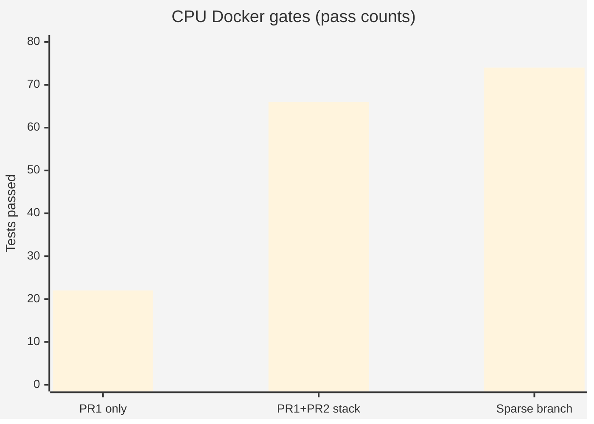
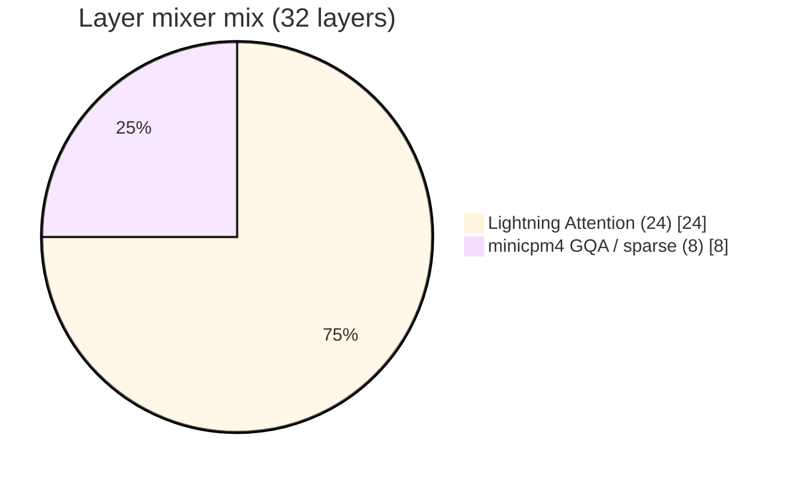
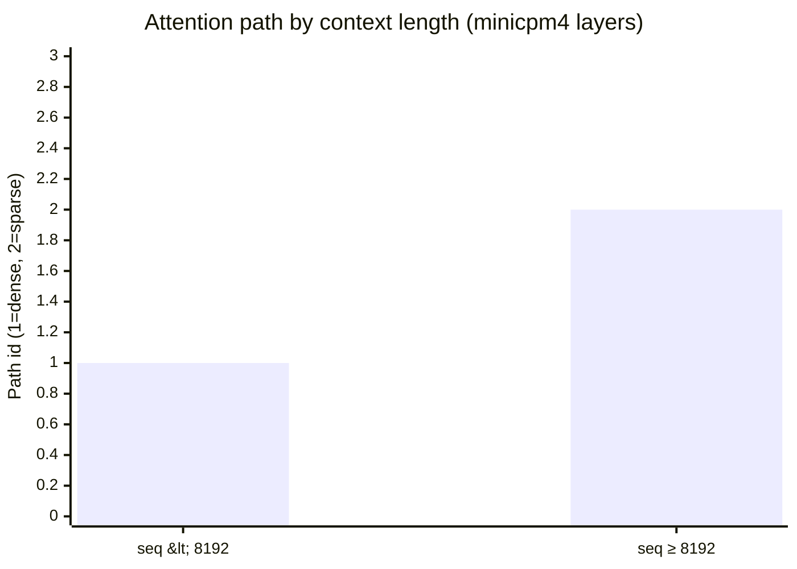
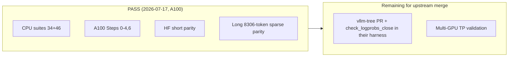
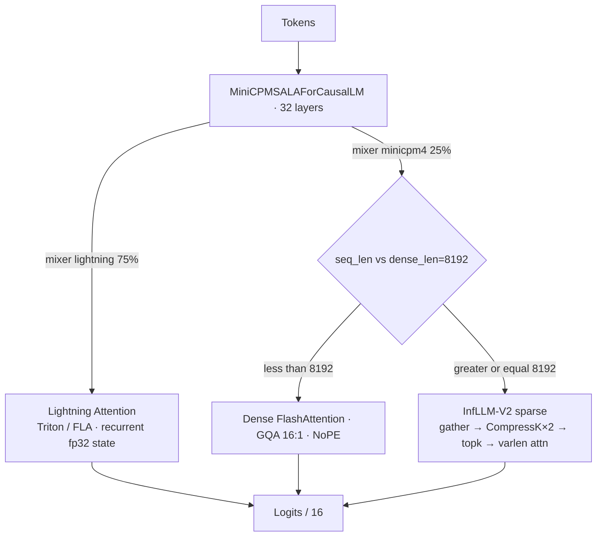
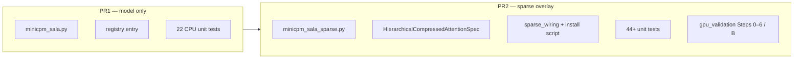
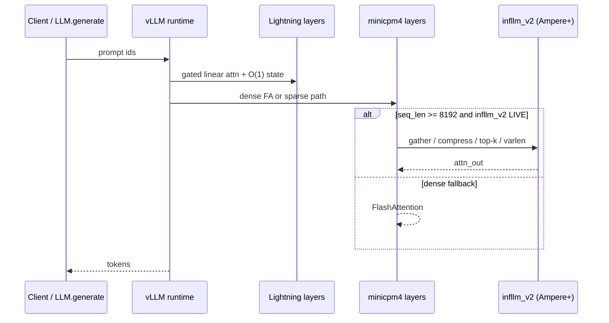
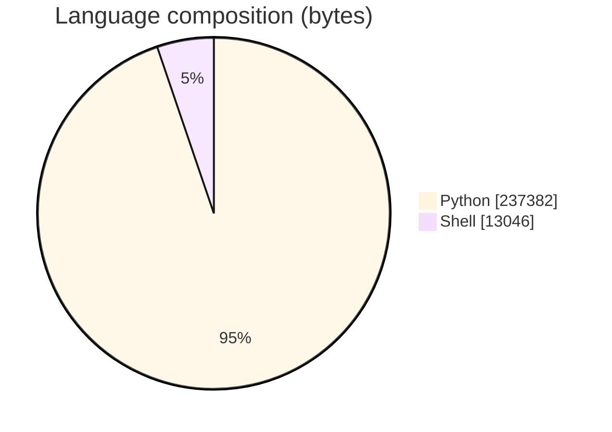

# vLLM HybridAttn — MiniCPM-SALA

### Upstream-oriented **vLLM 0.24/0.25** integration for [MiniCPM-SALA](https://huggingface.co/openbmb/MiniCPM-SALA): **75% Lightning Attention** + **25% GQA** (dense &lt; 8192 · InfLLM-V2 sparse ≥ 8192)

<p align="center">
  
  
  
  
</p>

<p align="center">
  
  
  
  
  
</p>

---

## Why this project

Hybrid LMs that mix **linear (Lightning) attention** with **long-context sparse GQA** do not drop cleanly into vanilla vLLM. This repo is an **inference-engineering / systems** deliverable aimed at upstream contribution:

| Track | Scope | Status (see [`docs/VALIDATION_REPORT.md`](docs/VALIDATION_REPORT.md)) |
|-------|--------|------------------------------------------------------------------------|
| **PR1** | Model + Lightning + dense GQA | CPU suites PASS; **HF greedy parity PASS (2026-07-17, A100)** |
| **PR2** | InfLLM-V2 sparse backend + KV specs | A100 Steps **0–4, 6 PASS**; **sparse-regime HF parity PASS (8306 tokens)** |

Portfolio signal for **ML Systems / GPU Inference / LLM Runtime** interviews: honest validation gates, PR splitting, KV-cache specs, and refusing fabricated tokens/sec ([`docs/performance.md`](docs/performance.md)).

> **Numbers below are copied from committed docs and logs. Results are not changed.** No invented throughput leaderboard.

---

## Results at a glance

### Validation gates (evidence-backed)

| Gate | Result | Source |
|------|--------|--------|
| PR1 CPU Docker (`docker_run_pr1.sh`) | **PASS** (34 cases) + ruff | VALIDATION 2026-07-17 |
| Full-stack Docker | **66/66 PASS** (22 PR1 + 44 PR2) | CHANGELOG / testing.md |
| Sparse-branch CPU suite | **74 PASS** on `feature/minicpm-sala-sparse` | VALIDATION_REPORT |
| Unit suite wall time | **~4 s** (Docker, CPU) | performance.md |
| A100 gated Steps **0–4, 6** (sparse LIVE, fixed code) | **PASS** (2026-07-17) | VALIDATION_REPORT |
| HF parity short prompts | **PASS** — greedy tokens identical, 3×16 steps (2026-07-17) | VALIDATION_REPORT + logs |
| HF parity long (≥8192 sparse) | **PASS** — 8306-token prompt, greedy identical (2026-07-17) | VALIDATION_REPORT + logs |
| Published tok/s / latency | **None** (explicitly pending) | performance.md |



### Model / architecture facts (config-backed)

| Spec | Value |
|------|--------|
| Weights | [`openbmb/MiniCPM-SALA`](https://huggingface.co/openbmb/MiniCPM-SALA) (~**19 GB** bf16) |
| Depth / size | **32** layers · **~9.5B** params |
| Hidden / heads | **4096** · **32** heads · **head_dim 128** |
| Layer mix | **75%** lightning-attn · **25%** minicpm4 (GQA) |
| Sparse layer indices | **{0, 9, 16, 17, 22, 29, 30, 31}** (8/32) |
| `dense_len` | **8192** (below → dense FlashAttention; at/above → InfLLM-V2 sparse) |
| GQA (sparse layers) | **16:1**; Lightning = **32:32** (no GQA) |
| Residual muP scale | `scale_depth / √32` ≈ **0.2475** on both branches |
| Lightning state / seq / layer | **2 MiB** fp32 `(32×128×128×4)` — **O(1)** in seq length |
| Sparse `block_size` | Multiple of **256** (gather validated at **256** on T1000) |
| CompressK | kernel **32** / stride **16** (+ coarser **128** / **64**) |
| Local window | **2048** tokens |
| Logits scale | hidden / `dim_model_base` → divide by **16** |





### Toolchain (A100 validation host)

| Component | Observed |
|-----------|----------|
| GPU | NVIDIA **A100 80 GB**, **sm_80** |
| vLLM | **0.25.0** (parity host; repo pin 0.24.0 also green) |
| PyTorch | **2.11+cu130** |
| infllm_v2 | Built for sm_80 (OpenBMB CUDA impl) |
| flash-attn / fla | 2.x · `chunk_simple_gla` reference |

### Bisect checkpoints (A100, before parity re-run)

| Checkpoint | `max_abs_diff` |
|------------|----------------|
| embed | **0.0** |
| layer-1 q after q_norm | **0.0** |
| layer-1 q after RoPE | **26.25** ⚠ HF harness artifact — see note |
| layer-1 attn (HF h₀ + fla) | **0.0** |

Short-prompt greedy mismatch example (last fail run): HF token **2132** vs vLLM **1709/3566**. Harness fixes landed **2026-07-07**; the **2026-07-16 audit** (line-by-line vs the real HF `modeling_minicpm_sala.py`) found and fixed four correctness bugs — zeroed lightning RoPE (the "26.25 after RoPE" row came from a bisect whose HF side had harness-zeroed `cos_cached`; real RoPE is now applied HF-exactly), fla decode layout, sparse top-k under-selection (64 → 96), and recurrent-state dtype. **2026-07-17: the re-run happened on an A100 — every gate is green and HF parity PASSES token-for-token in both regimes** (plus five vLLM-0.25 integration fixes and three kernel-contract fixes found live). Details + logs in [`docs/VALIDATION_REPORT.md`](docs/VALIDATION_REPORT.md).



---

## Architecture







Exact sparse layer schedule (not illustrative — config-verified):

```text
L0 sparse · L1–8 light · L9 sparse · L10–15 light · L16–17 sparse
L18–21 light · L22 sparse · L23–28 light · L29–31 sparse
```

More diagrams: [`docs/minicpm_sala_diagrams.md`](docs/minicpm_sala_diagrams.md)

---

## Sparse path (PR2)

```text
forward
  └─ if seq_len >= dense_len (8192):
        gather K → CompressK (32/16) → CompressK2 (128/64)
        → compressed_attention → topk_idx
        → infllmv2_attn_varlen_func
     else:
        FlashAttention (dense GQA)
```

Graceful **dense fallback** when `infllm_v2` is missing or GPU &lt; Ampere (**sm_80**). Debug-only: `MINICPM_SALA_DEBUG_SPARSE=1`.

---

## Repository layout

```text
vLLM-HybridAttn/
├── vllm/model_executor/models/minicpm_sala.py     # PR1 model
├── tests/models/language/generation/              # PR1 CPU tests
├── pr2/vllm/...                                   # sparse backend + KV specs
├── pr2/tests/v1/...                               # PR2 unit tests
├── pr2/scripts/gpu_validation/                    # A100 gated steps
├── scripts/install_pr2_overlay.sh
├── docker_run_pr1.sh · docker_run_integration.sh
├── docs/VALIDATION_REPORT.md · architecture.md · performance.md · ...
└── LICENSE · CHANGELOG · ROADMAP · CONTRIBUTING · SECURITY
```

Languages (GitHub): Python **237,382** B · Shell **13,046** B · **71** tracked files.



---

## Quickstart

```bash
git clone https://github.com/ArchanaChetan07/vLLM-HybridAttn.git
cd vLLM-HybridAttn

# PR1 CPU gate (no GPU required)
bash docker_run_pr1.sh          # expect ALL PR1 CPU tests + ruff PASS (22 + 8 new RoPE regression cases)

# PR2 overlay on a vLLM 0.24.0 install
pip install vllm==0.24.0
bash scripts/install_pr2_overlay.sh
bash docker_run_integration.sh  # full stack CPU / gated GPU host tooling

# Ampere+ host with weights
export MINICPM_SALA_WEIGHTS=/path/to/openbmb/MiniCPM-SALA
bash scripts/install_infllm_v2.sh          # builds OpenBMB/infllmv2_cuda_impl (sm_80)
bash pr2/scripts/gpu_validation/run_all_gpu_validation.sh   # Steps 0-6 + parity (B)
# or everything in one shot:
bash scripts/remote/a100_validation.sh
```

Upstream staging notes: [`docs/UPSTREAM_PR1.md`](docs/UPSTREAM_PR1.md) · PR briefs: [`docs/pull_requests/PR1_model.md`](docs/pull_requests/PR1_model.md), [`docs/pull_requests/PR2_sparse.md`](docs/pull_requests/PR2_sparse.md).

---

## Tech stack & keywords

| Layer | Technology |
|-------|------------|
| Serving | **vLLM 0.24** model executor / v1 attention backends |
| Model | **MiniCPM-SALA** hybrid causal LM (~9.5B) |
| Attention | Lightning / FLA · FlashAttention · **InfLLM-V2** top-k sparse |
| Runtime | **PyTorch**, **CUDA** sm_80+, Triton kernels |
| Quality | **pytest**, **ruff**, Docker gates, A100 validation scripts |
| Process | Split **PR1 / PR2**, validation report, merge readiness checklist |

**Keyword surface:** Python · vLLM · PyTorch · CUDA · GPU inference · Lightning Attention · linear attention · GQA · InfLLM-V2 · sparse attention · KV cache · long context · FlashAttention · Triton · pytest · Docker · ML systems · LLM serving · Ampere A100 · open-source contribution

---

## What we claim vs what we do not

| Claim | OK? |
|-------|-----|
| PR1/PR2 unit + Docker gates green | **Yes** |
| Sparse kernels **execute** LIVE on A100 (Steps 0–4, 6) | **Yes** |
| Numerical HF parity (greedy, dense + sparse regimes) | **Yes** — 2026-07-17, A100, logs committed |
| Throughput / latency leaderboard | **No** — see benchmark plan only |

The former merge blocker (HF short + long parity) **cleared 2026-07-17**. Remaining for upstream: package as a real vllm-tree PR, run `check_logprobs_close` in their harness, and validate multi-GPU TP ([`docs/merge_readiness_checklist.md`](docs/merge_readiness_checklist.md)).

---

## Related docs

| Doc | Purpose |
|-----|---------|
| [`docs/VALIDATION_REPORT.md`](docs/VALIDATION_REPORT.md) | PASS vs PENDING evidence |
| [`docs/architecture.md`](docs/architecture.md) | Executive architecture |
| [`docs/performance.md`](docs/performance.md) | Explicitly empty bench table |
| [`docs/testing.md`](docs/testing.md) | Test matrix |
| [`docs/minicpm_sala_benchmark_plan.md`](docs/minicpm_sala_benchmark_plan.md) | How tok/s will be measured later |
| [`docs/DESIGN_RFC.md`](docs/DESIGN_RFC.md) | Design intent |

---

<p align="center">
  <b>vLLM HybridAttn (MiniCPM-SALA)</b><br/>
  <a href="https://github.com/ArchanaChetan07/vLLM-HybridAttn">github.com/ArchanaChetan07/vLLM-HybridAttn</a>
</p>
