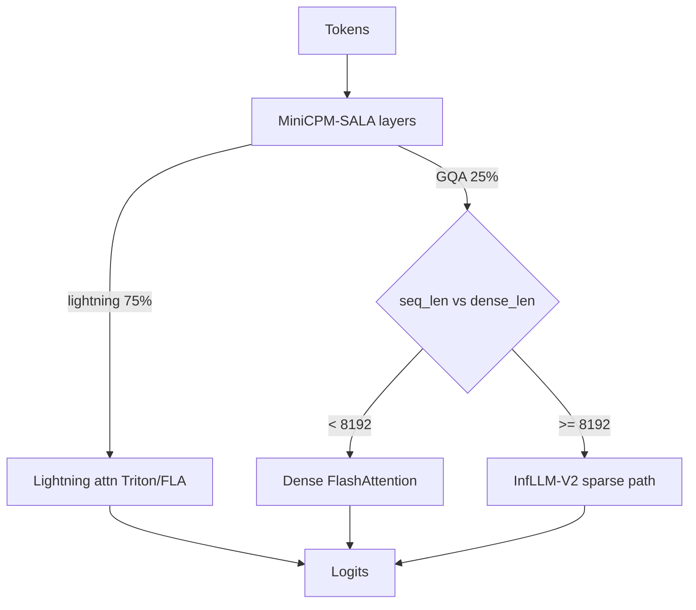
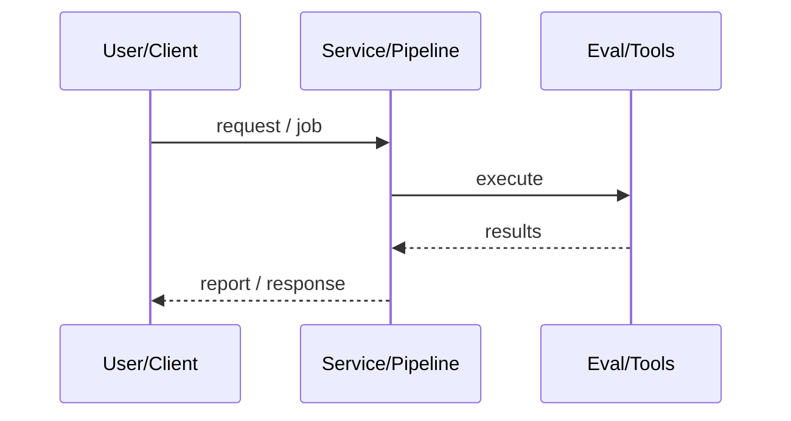
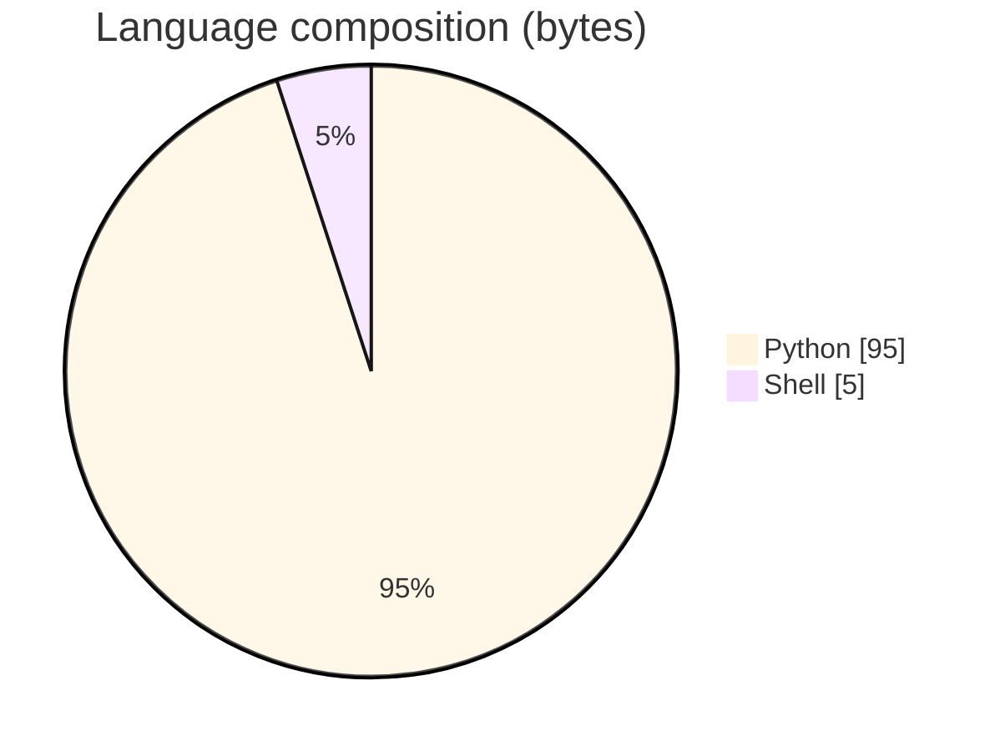

# vLLM HybridAttn (MiniCPM-SALA)

### Upstream-oriented vLLM support for MiniCPM-SALA hybrid lightning + GQA/sparse attention with PR1 model and PR2 sparse overlay.

[](https://github.com/ArchanaChetan07/vLLM-HybridAttn)
[](https://github.com/ArchanaChetan07/vLLM-HybridAttn)
[](https://github.com/ArchanaChetan07/vLLM-HybridAttn)
[](https://github.com/ArchanaChetan07/vLLM-HybridAttn/actions)

---

## Overview

Hybrid models mixing linear (lightning) attention and sparse long-context GQA need first-class vLLM model/backends, KV specs, and honest validation—not slogan throughput claims.

PR1: MiniCPM-SALA model + lightning/dense path; PR2 overlay: sparse InfLLM-V2 backend, gather/compress, KV cache specs; Docker CPU gates; A100 GPU validation scripts; extensive docs.

PR1 Docker CPU gate 22/22 tests; 32-layer ~9.5B schedule is 75% lightning-attn / 25% GQA; GPU sparse path runs on A100 but HF parity still pending before upstream PR1 merge.

This repository is maintained as **production-minded portfolio work**: clear architecture, automated checks where present, and metrics that are **traceable to committed artifacts** (never invented).

---

## Architecture

Forward selects lightning vs GQA; GQA uses dense FlashAttention below dense_len else sparse gather/CompressK/topk InfLLM-V2; lightning keeps O(1) recurrent state.





---

## Results & repository facts

> Only values found in code, configs, tests, or generated reports are listed. Absence of a clinical/ML accuracy number means it was **not** published in-repo.

| Metric | Value | Source |
|---|---|---|
| PR1 CPU Docker gate | **22 tests PASS** | `docs/VALIDATION_REPORT.md` |
| Model depth / size | **32 layers ~9.5B params** | `docs/architecture.md` |
| Lightning vs GQA layer mix | **75% lightning-attn / 25% minicpm4 GQA** | `docs/architecture.md` |
| dense_len threshold | **8192** | `docs/architecture.md` |
| vLLM version (validation host) | **0.24.0** | `docs/VALIDATION_REPORT.md` |
| Published throughput/latency benches | **none (explicitly pending)** | `docs/performance.md` |
| Tracked files | **71** | `git tree` |
| Python modules | **27** | `git tree` |
| Test-related paths | **18** | `git tree` |
| CI workflows | **Yes** | `.github/workflows` |
| Docker present | **No** | `repo root` |



---

## Key features

- MiniCPM-SALA model executor integration for vLLM
- Lightning-attention layers with recurrent fp32 state
- GQA dense below dense_len=8192 and InfLLM-V2 sparse above
- PR2 sparse overlay install script and GPU validation steps 0-4/6
- CPU unit gates for PR1 and fuller sparse overlay suites
- Audit/validation docs separating PASS vs PENDING claims

---

## Tech stack

| Layer | Technology |
|---|---|
| Language | Python |
| Framework | vLLM |
| Framework | PyTorch |
| Tool | infllm_v2 CUDA |
| Tool | flash-attn / fla |
| Tool | Docker |
| Tool | pytest |

---

## Skills demonstrated

Python · vLLM 0.24 · PyTorch · pytest · infllm_v2 · Docker · CI/CD · testing · automation

Keyword surface: **Python · Python · machine-learning · CI/CD · testing · API · Docker · automation · data-science · software-engineering · system-design · observability · LLM · cloud**

---

## Project structure

```text
vLLM-HybridAttn/
├── vllm/.../minicpm_sala.py          # PR1
├── pr2/vllm/...                      # sparse overlay + tests
├── pr2/scripts/gpu_validation/
├── docs/  # VALIDATION_REPORT, architecture, performance
└── LICENSE CHANGELOG ROADMAP scripts/
```

---

## Installation & usage

```bash
git clone https://github.com/ArchanaChetan07/vLLM-HybridAttn.git
cd vLLM-HybridAttn
pip install vllm==0.24.0
bash docker_run_pr1.sh   # 22 pytest + ruff PR1 gate
bash scripts/install_pr2_overlay.sh
bash pr2/scripts/gpu_validation/run_all_gpu_validation.sh  # Ampere+
```

---

## How it works

PR1 registers the hybrid MiniCPM-SALA model with lightning layers and dense GQA. PR2 overlays sparse attention backends, KV cache specs, and metadata builders; install_pr2_overlay.sh layers those files onto a vLLM install. CPU Docker gates keep PR1 mergeable without GPUs; A100 scripts exercise live sparse kernels while VALIDATION_REPORT.md keeps HF parity as a blocker for claiming numerical correctness.

performance.md refuses fabricated tokens/sec until the benchmark plan runs.

---

## Future improvements

- Re-run and pass HF parity (short and long sparse regimes)
- Upstream PR1 after numerical verification
- Publish Ampere+ throughput results per benchmark plan

---

## License

NOASSERTION.

---

<p align="center">
  <b>vLLM HybridAttn (MiniCPM-SALA)</b><br/>
  <a href="https://github.com/ArchanaChetan07/vLLM-HybridAttn">github.com/ArchanaChetan07/vLLM-HybridAttn</a>
</p>
