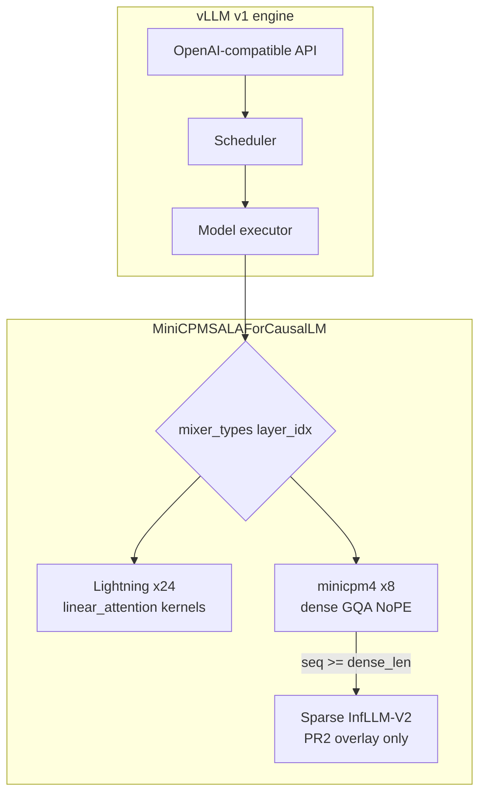

# MiniCPM-SALA for vLLM

**A production-oriented vLLM integration of [MiniCPM-SALA](https://huggingface.co/openbmb/MiniCPM-SALA)** — OpenBMB's 9B hybrid-attention model combining gated linear (Lightning) attention with InfLLM-V2 sparse GQA for long contexts.

[](https://github.com/ArchanaChetan07/vLLM-HybridAttn/actions/workflows/ci.yml)
[](docs/VALIDATION_REPORT.md)
[](docs/VALIDATION_REPORT.md)
[](https://github.com/vllm-project/vllm)
[](LICENSE)

> **Honest status (2026-07-07):** CPU tests and sparse **pipeline** gates pass on real A100 hardware.
> **HF logprob parity has not passed** — the model is not numerically verified for upstream merge.
> See [Validation evidence](#validation-evidence).

---

## At a glance

MiniCPM-SALA interleaves two attention mechanisms across **32 layers**:

| Mechanism | Share | Role |
|-----------|-------|------|
| **Lightning attention** | 75% (24 layers) | Gated linear attention, O(1) recurrent state per head |
| **Sparse GQA (`minicpm4`)** | 25% (8 layers) | Dense FlashAttention below `dense_len=8192`; InfLLM-V2 sparse at/above |



**Upstream plan:** [PR1](docs/UPSTREAM_PR1.md) lands the model + lightning + dense fallback alone.
[PR2](docs/pull_requests/PR2_sparse.md) adds optional sparse execution via `infllm_v2`.

---

## How it works

### Lightning path (PR1)

- Layers with `mixer_type=lightning-attn` register as `MambaBase` / `PluggableLayer`.
- Prefill and decode dispatch through vLLM's `torch.ops.vllm.linear_attention` (same family as `MiniMaxText01LinearAttention`).
- Recurrent state is **fp32**; activations are typically **bf16**.
- Differs from stock MiniMax: **RoPE** on q/k, **qk RMSNorm**, **unscaled** decay slopes (see [DESIGN_RFC.md](docs/DESIGN_RFC.md)).

### Dense / sparse path (`minicpm4`)

- **PR1:** standard vLLM `Attention` (NoPE GQA, optional output gate). Correct for contexts **below** `dense_len`.
- **PR2 overlay:** replaces the attention backend with `minicpm_sala_sparse` when `infllm_v2` is installed — gather, CompressK, `compressed_attention`, InfLLM kernels. Mixed batches scatter per sequence.

### PR1 / PR2 split

| | PR1 (`vllm/...`) | PR2 (`pr2/vllm/...` overlay) |
|--|----------------|----------------------------|
| Mergeable standalone | Yes | No (depends on PR1 + `infllm_v2`) |
| Lightning layers | Yes | Same file in overlay |
| Sparse kernels | No | Yes |
| Custom KV spec | No | Yes |

PR1 **never** imports sparse modules. Install PR2 after `pip install vllm`:

```bash
bash scripts/install_pr2_overlay.sh
```

---

## Quickstart

### PR1 only (upstream-mergeable path)

```bash
pip install vllm==0.24.0
# Copy vllm/model_executor/models/minicpm_sala.py into your vLLM tree
# Apply patches/registry.py.patch and patches/tests_registry.py.patch

python -m vllm.entrypoints.openai.api_server \
  --model openbmb/MiniCPM-SALA \
  --trust-remote-code \
  --dtype bfloat16
```

Docker gate (CPU tests, no GPU):

```bash
bash docker_run_pr1.sh
```

### PR2 sparse overlay (optional; requires Ampere+ and `infllm_v2`)

```bash
pip install vllm==0.24.0
bash scripts/install_infllm_v2.sh
bash scripts/install_pr2_overlay.sh

export MINICPM_SALA_WEIGHTS=/path/to/MiniCPM-SALA
bash pr2/scripts/gpu_validation/run_all_gpu_validation.sh
```

**Dependency:** [infllm_v2](https://github.com/OpenBMB/infllmv2_cuda_impl) is **not** bundled. Without it, the model **degrades to dense** `Attention` on `minicpm4` layers.

---

## Validation evidence

Full report: **[docs/VALIDATION_REPORT.md](docs/VALIDATION_REPORT.md)**

| Check | Environment | Result |
|-------|-------------|--------|
| PR1 CPU unit tests | Docker (`docker_run_pr1.sh`) | **PASS** (22/22) |
| PR2 CPU unit tests | `feature/minicpm-sala-sparse` | **PASS** (74/74) |
| Sparse path LIVE (Step 0) | A100 sm_80 | **PASS** |
| Kernel dispatch + gather + sparse e2e (Steps 1-4) | A100 | **PASS** (execution, not correctness) |
| Mixed-batch invariance (Step 6) | A100 | **PASS** |
| HF parity short prompts | A100 | **FAIL** |
| HF parity long (>=8192) | A100 | **Pending** |
| `check_logprobs_close` (upstream harness) | — | **Not run / not green** |

We do **not** claim numerical equivalence until parity passes on a clean clone with committed fixes.

---

## Benchmarks

No publishable throughput/latency numbers yet. Plan: [docs/minicpm_sala_benchmark_plan.md](docs/minicpm_sala_benchmark_plan.md).

---

## Limitations and scope

| Topic | Status |
|-------|--------|
| HF logprob parity | **Blocking** — not verified |
| Long-context sparse correctness | Pipeline runs; parity pending |
| `infllm_v2` | External CUDA extension; sm_80+; optional with dense fallback |
| TP > 1 | Sharding reviewed on CPU; multi-GPU NCCL not validated |

Details: [docs/minicpm_sala_known_limitations.md](docs/minicpm_sala_known_limitations.md)

---

## Repository layout

```
vllm/model_executor/models/minicpm_sala.py   # PR1 — dense + lightning only
tests/models/language/generation/            # PR1 tests + parity scaffold
pr2/vllm/                                    # PR2 overlay
pr2/scripts/gpu_validation/                  # Gated GPU validation
patches/                                     # Registry patches for upstream
docs/                                        # RFC, validation, upstream PR draft
```

---

## Upstreaming

| Deliverable | Location |
|-------------|----------|
| Staged PR1 branch | `feature/pr1-upstream-staging` |
| Draft PR description (not submitted) | [docs/UPSTREAM_PR1.md](docs/UPSTREAM_PR1.md) |
| Design rationale | [docs/DESIGN_RFC.md](docs/DESIGN_RFC.md) |

**The upstream PR to `vllm-project/vllm` is not opened without explicit authorization.**

---

## License

Apache 2.0 — see [LICENSE](LICENSE).
