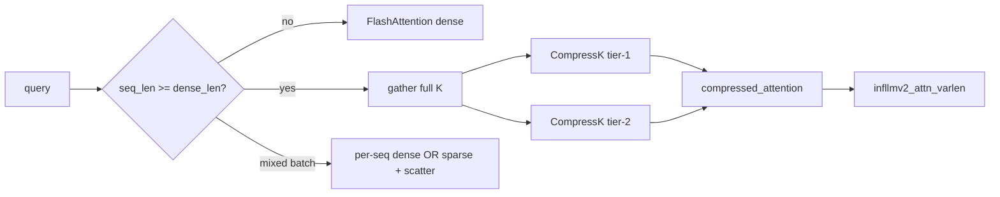
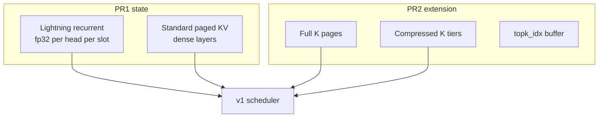
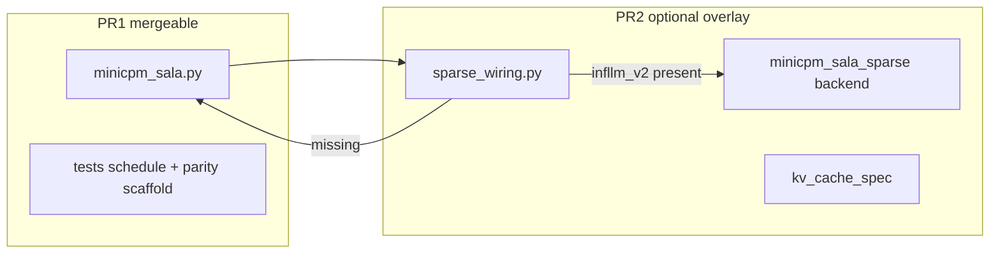

# Design RFC — MiniCPM-SALA vLLM integration

**Status:** Accepted for implementation; numerical parity **pending**.  
**Audience:** vLLM maintainers and contributors porting PR1/PR2.

Deep dive: [minicpm_sala_phase1_architecture_report.md](minicpm_sala_phase1_architecture_report.md)

---

## 1. Problem statement

[MiniCPM-SALA](https://huggingface.co/openbmb/MiniCPM-SALA) is a ~9B causal LM that mixes:

- **Lightning attention** (75% of layers) — gated linear attention with decay, O(1) state per head
- **Sparse GQA** (25% of layers) — InfLLM-V2 block-sparse attention when context ≥ `dense_len`

Serving this in vLLM requires hybrid scheduling, custom recurrent state, optional sparse
kernels, and checkpoint-faithful muP scaling — not a thin wrapper around `LlamaForCausalLM`.

## 2. Layer schedule

32 layers; pattern repeats every 4:

```
L0  minicpm4        (sparse-capable GQA)
L1  lightning-attn
L2  minicpm4
L3  lightning-attn
...
```



```mermaid
gantt
    title MiniCPM-SALA 32-layer schedule (1 block = 4 layers)
    dateFormat X
    axisFormat %L

    section Block 0
    minicpm4 L0     :0, 1
    lightning L1    :1, 1
    minicpm4 L2     :2, 1
    lightning L3    :3, 1
```

(8× `minicpm4`, 24× `lightning-attn`.)

## 3. Attention paths

### 3.1 Lightning (PR1)

| Aspect | Reference (HF) | vLLM PR1 |
|--------|----------------|----------|
| Kernel | `fla` `chunk_simple_gla` / `fused_recurrent` | `lightning_attention` Triton (MiniMax family) |
| State dtype | fp32 recurrent | fp32 (`get_state_dtype`) |
| RoPE | On q/k before recurrence | `get_rope` (neox layout); **parity alignment in progress** |
| q/k norm | RMSNorm per head | `RMSNorm(head_dim)` |
| Output | `o_norm` → sigmoid gate → `o_proj` | Same order |

**Why not stock MiniMax only:** checkpoint enables RoPE + qk_norm + unscaled slopes.

### 3.2 Dense GQA (PR1)

`minicpm4` layers: NoPE, GQA 16:1, optional `o_gate` (column-parallel under TP).  
PR1 uses vLLM `Attention` + FlashAttention below `dense_len`.

### 3.3 Sparse (PR2 only)



**Page constraint:** `block_size % 256 == 0` (InfLLM-V2 page KV layout).

## 4. KV cache



PR1: `HasInnerState` + default attention KV.  
PR2: `MiniCPMSALAKVCacheSpec` registers hierarchical spec with v1 KV registry.

## 5. PR1 / PR2 boundary



PR1 never imports PR2. PR2 monkey-patches dense attention factory at runtime via wiring module.

## 6. muP scaling

Reference: `hidden = residual + branch * (scale_depth / sqrt(num_layers))`.  
Applied on **both** attention and MLP branches. Not optional; not fused away.

## 7. Dependency story (PR2)

| Option | Decision |
|--------|----------|
| Vendor `infllm_v2` in vLLM | **Rejected** — CUDA extension, CUTLASS pin, sm_80+ |
| Documented optional pip install | **Chosen** — `scripts/install_infllm_v2.sh` + `patches/fix_cutlass_submodule.sh` |
| Graceful degradation | `create_sparse_attention_if_available()` → dense `Attention` |

## 8. Correctness envelope

**Validated:** structural tests, kernel dispatch, sparse LIVE, mixed-batch plumbing.  
**Not validated:** HF logprob parity (short or long). See [VALIDATION_REPORT.md](VALIDATION_REPORT.md).

Do not describe the port as production-ready for numerical accuracy until Stage 0 parity passes.

## 9. References

- HF weights: `openbmb/MiniCPM-SALA`
- vLLM pin: `8cfeb84` (2026-07-01 main)
- InfLLM-V2: OpenBMB/infllmv2_cuda_impl
