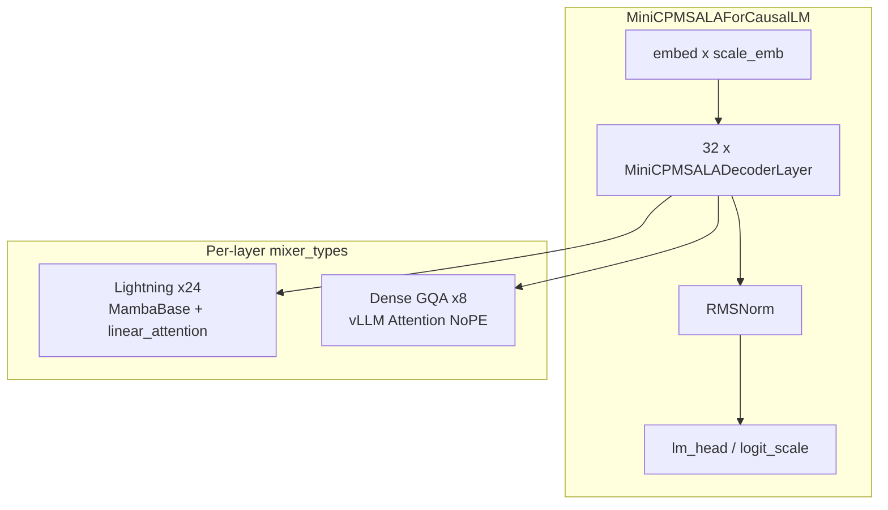

# Upstream PR1 — MiniCPM-SALA model support (draft)

> **Status:** Staged on branch `feature/pr1-upstream-staging`.  
> **Do not merge** until HF `check_logprobs_close` passes on maintainer CI hardware.  
> This file is the PR description to paste into `vllm-project/vllm` when authorized.

---

## Summary

Adds inference support for [MiniCPM-SALA](https://huggingface.co/openbmb/MiniCPM-SALA) to vLLM:
a 32-layer hybrid model combining **gated linear (Lightning) attention** on 24 layers and
**dense GQA** on 8 `minicpm4` layers. This PR is **self-contained**: no `infllm_v2`, no sparse
backend, no custom KV-cache spec.

Long-context InfLLM-V2 sparse attention is intentionally deferred to a follow-up PR (see
[dependency plan](#follow-up-pr2-sparse)).

## Motivation

MiniCPM-SALA requires:

- Per-layer **mixer dispatch** (`lightning-attn` vs `minicpm4`)
- **NoPE** dense GQA with optional output gate on sparse-designated layers
- **Gated linear attention** with RoPE, q/k RMSNorm, and Mamba-compatible recurrent state
- **muP residual scaling** (`scale_depth / sqrt(num_layers)`)
- `HasInnerState` / `IsHybrid` integration for vLLM v1 scheduler + KV interfaces

None of this exists as a single upstream model today. This PR reuses vLLM’s existing
`MiniMaxText01LinearAttention` kernel family for lightning layers rather than inventing new
Triton from scratch.

## Architecture



| Layer type | Count | Implementation |
|------------|-------|----------------|
| `lightning-attn` | 24 | `MiniCPMSALALightningAttention` → `torch.ops.vllm.linear_attention` |
| `minicpm4` | 8 | `MiniCPMSALADenseAttention` → standard `Attention` (dense GQA, NoPE) |

**Below `dense_len=8192`:** all attention is dense (PR1 scope).  
**At/above `dense_len`:** PR1 continues to use dense GQA; sparse InfLLM-V2 is PR2.

## Design choices

### Reuse vLLM linear-attention infrastructure

Lightning layers register in `compilation_config.static_forward_context` and dispatch through
the same custom op as `MiniMaxText01LinearAttention`. This gives chunked prefill, decode, and
CUDA-graph compatibility without a parallel kernel stack.

### Custom lightning path (why not stock MiniMax only)

The reference checkpoint differs from MiniMax in three ways (verified against HF
`modeling_minicpm_sala.py`):

1. **RoPE** on lightning q/k (MiniMax has none)
2. **Per-head q/k RMSNorm** before RoPE
3. **Unscaled decay slopes** (no layer-index slope scaling)

These are implemented in `MiniCPMSALALightningAttention._forward`, not by subclassing MiniMax.

### muP residual scaling

Decoder layers apply `residual + branch * (scale_depth / sqrt(num_hidden_layers))` on both
attention and MLP branches. This intentionally avoids vLLM’s fused residual-norm API, which
would drop the scale factor.

### Dense fallback (PR1)

`minicpm4` layers use vLLM `Attention` with FlashAttention backend auto-selection. This
matches HF behavior below `dense_len` and keeps PR1 mergeable without external CUDA extensions.

## Files changed

```
vllm/model_executor/models/minicpm_sala.py          # new
vllm/model_executor/models/registry.py              # +1 entry (see patches/registry.py.patch)
tests/models/registry.py                            # +1 entry (see patches/tests_registry.py.patch)
tests/models/language/generation/test_minicpm_sala_schedule.py
tests/models/language/generation/test_minicpm_sala_fused_residual.py
tests/models/language/generation/test_minicpm_sala_mamba_helpers.py
tests/models/language/generation/test_minicpm_sala.py
```

Apply `patches/registry.py.patch` and `patches/tests_registry.py.patch` when porting to a vLLM fork.

## Tests

| Test file | Cases | What it covers |
|-----------|-------|----------------|
| `test_minicpm_sala_schedule.py` | 17 | Mixer schedule, layer dispatch helpers |
| `test_minicpm_sala_fused_residual.py` | 4 | muP residual math |
| `test_minicpm_sala_mamba_helpers.py` | 2 | State shape / dtype contracts |
| `test_minicpm_sala.py` | 1 | HF `check_logprobs_close` (GPU + weights) |

```bash
pytest tests/models/language/generation/test_minicpm_sala_*.py -m "not hybrid_model"  # unit only
pytest tests/models/language/generation/test_minicpm_sala.py -m hybrid_model        # GPU parity
```

**CI today:** 22/22 CPU tests pass in `docker_run_pr1.sh`.  
**Pending:** `test_minicpm_sala.py` has not passed on CI hardware (see validation evidence).

## Validation evidence

From [docs/VALIDATION_REPORT.md](VALIDATION_REPORT.md) (external repo, reproducible logs):

| Claim | Status |
|-------|--------|
| Weight loading + registry resolution | Validated |
| Lightning kernel dispatch (prefill + decode) | Validated on A100 (sparse branch overlay) |
| CPU unit tests | **22/22 PASS** |
| HF short-prompt `check_logprobs_close` | **FAIL** (blocking) |
| HF long-context sparse parity | **Pending** |

We do **not** claim numerical equivalence until parity passes. Bisect work (2026-07-07) shows
embed + projections match; remaining drift is in dense-layer attention path and lightning
RoPE/kernel policy.

## Known limitations (PR1)

- `minicpm4` layers: dense GQA only; contexts ≥8192 use dense attention until PR2
- Lightning kernels: Ampere+ (sm_80+) at runtime; recurrent state in **fp32**
- TP>1: sharding arithmetic reviewed on CPU/gloo; not re-verified on multi-GPU NCCL
- `check_logprobs_close`: scaffold present, not green

Full list: upstream port should link to `docs/minicpm_sala_known_limitations.md` in the
integration repo.

## Follow-up PR2 (sparse)

| Topic | Plan |
|-------|------|
| Dependency | `infllm_v2` from [OpenBMB/infllmv2_cuda_impl](https://github.com/OpenBMB/infllmv2_cuda_impl) |
| Integration | Optional overlay: `minicpm_sala_sparse_wiring.py` + `minicpm_sala_sparse` backend |
| KV cache | `MiniCPMSALAKVCacheSpec` (hierarchical full + compressed tiers) |
| Degradation | Import guard → dense `Attention` when `infllm_v2` absent |
| Page constraint | `block_size % 256 == 0` (InfLLM-V2 contract) |

PR2 is **not** required to merge PR1.

## Checklist for reviewers

- [x] Single `minicpm_sala.py`; no sparse/infllm imports
- [x] Registered in model + test registries (patches provided)
- [x] `HasInnerState`, `IsHybrid`, `SupportsPP` declared accurately
- [x] ruff clean
- [x] CPU unit tests (22) pass in Docker gate
- [ ] `check_logprobs_close` green on GPU CI
- [ ] Multi-GPU TP smoke (deferred; documented)

## Suggested commit message

```
Add MiniCPM-SALA hybrid attention model

Introduces MiniCPMSALAForCausalLM with lightning linear attention layers
(reusing vLLM MiniMax kernels) and dense NoPE GQA for minicpm4 layers.
Includes schedule tests and HF parity scaffold; sparse InfLLM-V2 path
is follow-up work.
```

Signed-off-by: Archana Chetan <archana@example.com>  <!-- owner: update email -->
