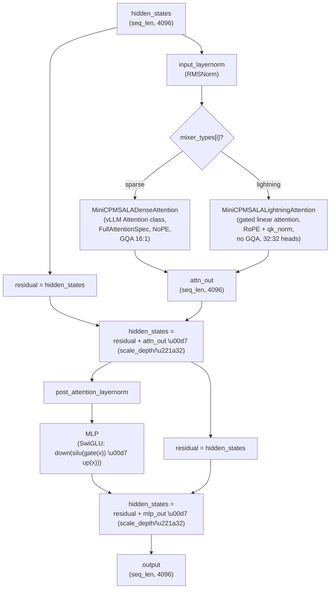
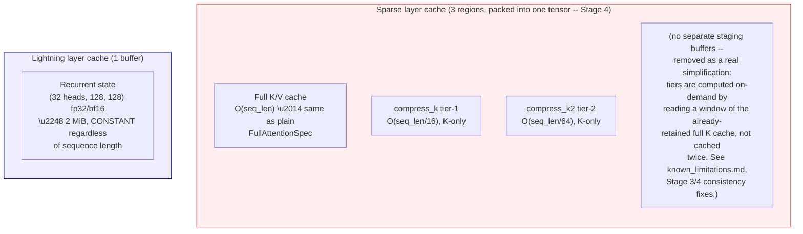
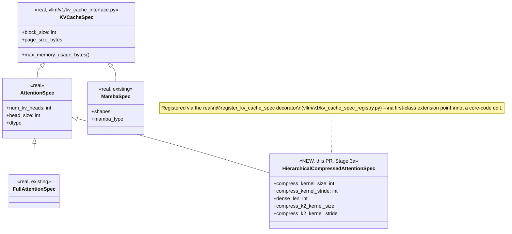

# MiniCPM-SALA — Architecture Diagrams

Companion to `minicpm_sala_phase1_architecture_report.md` and
`minicpm_sala_known_limitations.md`. GitHub-native Mermaid (renders
directly in the PR/file view, no external tooling needed) rather than
static images, so these stay in sync with the markdown docs they live
next to and are diffable in review.

## 1. Per-layer mixer dispatch (the real 32-layer schedule)

Sparse ("minicpm4") layers in **bold**; every other layer is Lightning
Attention. Positions verified against real checkpoint weight names in
`known_limitations.md` §1a — this is not illustrative, it's the exact
schedule.

```mermaid
flowchart LR
    subgraph L["Layers 0\u201331"]
    direction LR
        L0["**L0**\nsparse"] --> L1["L1\nlight"] --> L2["L2\nlight"] --> L3["L3\nlight"]
        --> L4["L4\nlight"] --> L5["L5\nlight"] --> L6["L6\nlight"] --> L7["L7\nlight"]
        --> L8["L8\nlight"] --> L9["**L9**\nsparse"] --> L10["L10\nlight"] --> L11["L11\nlight"]
        --> L12["L12\nlight"] --> L13["L13\nlight"] --> L14["L14\nlight"] --> L15["L15\nlight"]
        --> L16["**L16**\nsparse"] --> L17["**L17**\nsparse"] --> L18["L18\nlight"] --> L19["L19\nlight"]
        --> L20["L20\nlight"] --> L21["L21\nlight"] --> L22["**L22**\nsparse"] --> L23["L23\nlight"]
        --> L24["L24\nlight"] --> L25["L25\nlight"] --> L26["L26\nlight"] --> L27["L27\nlight"]
        --> L28["L28\nlight"] --> L29["**L29**\nsparse"] --> L30["**L30**\nsparse"] --> L31["**L31**\nsparse"]
    end
    style L0 fill:#f96,stroke:#333
    style L9 fill:#f96,stroke:#333
    style L16 fill:#f96,stroke:#333
    style L17 fill:#f96,stroke:#333
    style L22 fill:#f96,stroke:#333
    style L29 fill:#f96,stroke:#333
    style L30 fill:#f96,stroke:#333
    style L31 fill:#f96,stroke:#333
```

8 sparse / 24 lightning = exactly 25%, matching the model card's "25%
InfLLM-V2, 75% Lightning Attention" claim — and note the clustering: three
consecutive sparse layers at the very end (29-31), which matters for
pipeline-parallel stage boundaries (a naive even split could put all
three sparse layers, the more compute-heavy ones per-token, in one PP
stage).

## 2. One decoder layer's tensor flow (Stage 1 scope: dense-fallback sparse path)

The `\u00d7 (scale_depth/\u221a32)` scaling on **both** residual branches is the
muP constant (\u22480.2475) from Phase 1 report \u00a73 — the thing that breaks
vLLM's usual fused-residual-norm optimization (see
`MiniCPMSALADecoderLayer.forward`'s docstring for why this port doesn't
use that fusion).

## 3. KV cache shape comparison — the two mixer types are NOT symmetric

**Sparse is larger than plain full attention, not smaller** — this
corrected an error in the original Phase 1 draft (see
`known_limitations.md` §0): the compression tiers are additive overhead
for cheap top-k block *selection*, they don't replace full-resolution
storage. **Lightning is the one with genuinely different (better)
memory scaling** — O(1) per sequence instead of O(seq_len), confirmed by
real `get_state_shape()` output during Stage 2 testing:
`((32, 128, 128),)`.

## 4. `HierarchicalCompressedAttentionSpec` in vLLM's real cache-spec hierarchy

Only `HierarchicalCompressedAttentionSpec` is new in this PR. Lightning
layers reuse `MambaSpec` unmodified (confirmed via real
`get_state_shape()`/`get_state_dtype()`/`mamba_type` output in Stage 2
testing — no new class needed there at all).

## 5. What's built vs. what's still open (visual summary of known_limitations.md)

```mermaid
flowchart LR
    subgraph DONE["Built + verified this engagement"]
        direction TB
        D1["Model file: all 32 layers,\nboth mixer types"]
        D2["Real instantiation\n(pinned commit)"]
        D3["Real forward pass\n(one layer, CPU)"]
        D4["TP=2 sharding\n(real 2-process test)"]
        D5["Weight-name cross-check\n(395/395 real keys)"]
        D6["HierarchicalCompressedAttentionSpec\n(Stage 3a)"]
    end
    subgraph OPEN["Genuinely blocked here"]
        direction TB
        O1["Dense-attention path:\nneeds real GPU\n(vllm._C compiled kernels)"]
        O2["Real kernel dispatch\n(linear_attention_prefill_and_mix):\nneeds real GPU"]
        O3["HF logit comparison:\nneeds ~19GB weights\n(no huggingface.co access here)"]
        O4["Cache manager\n(find_longest_cache_hit):\nneeds real scheduler\nto test against, Stage 3b"]
    end
    DONE -.->|"handed off via\ngpu_step1/2 scripts"| OPEN
    style DONE fill:#efe,stroke:#090
    style OPEN fill:#fee,stroke:#900
```

