### Overall system

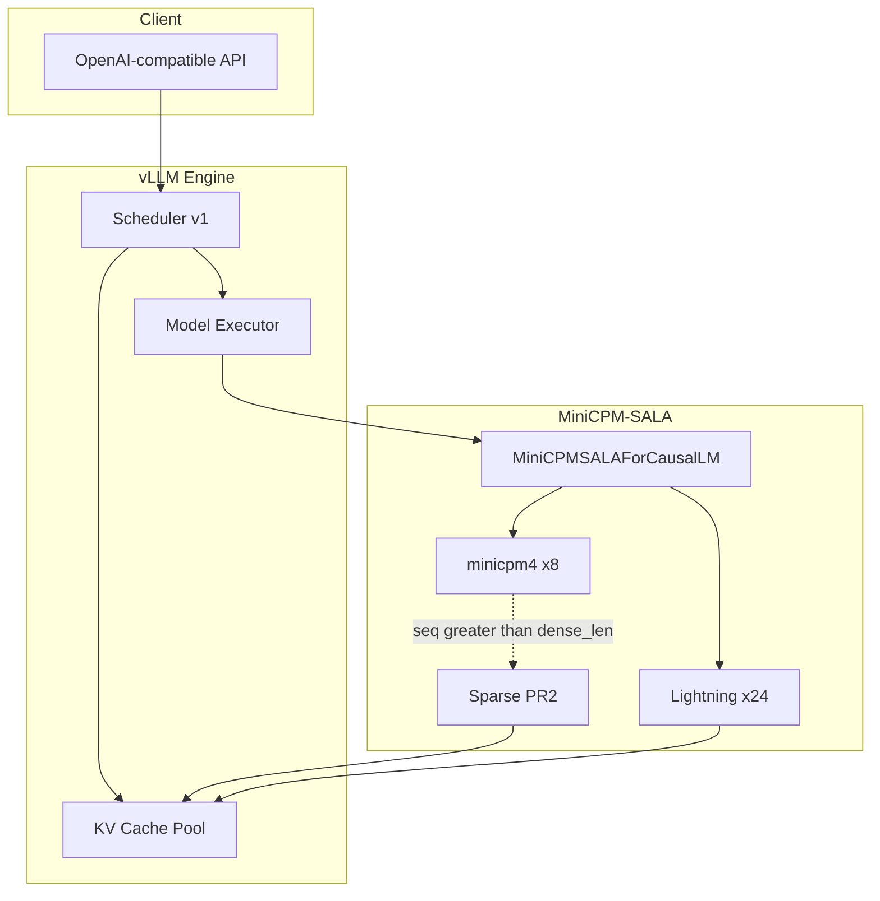

### Model hierarchy

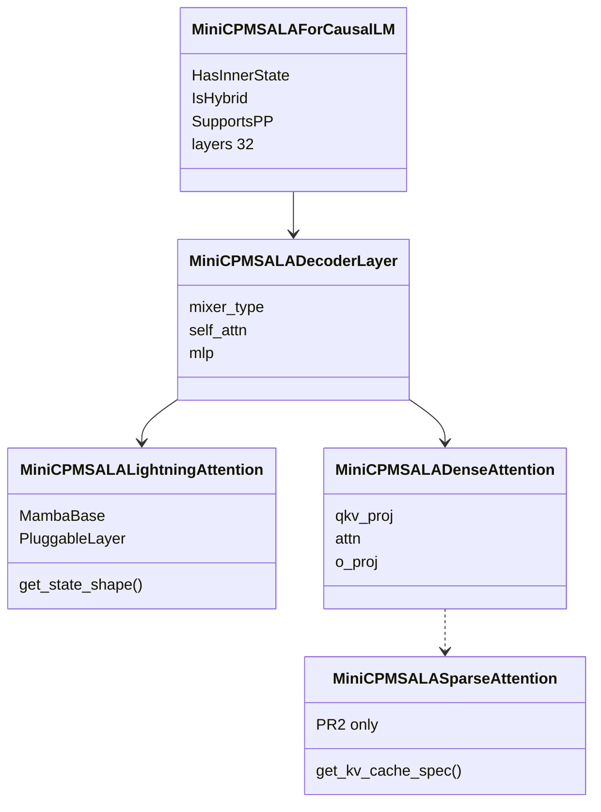

### Module dependency graph (PR1 / PR2 boundary)

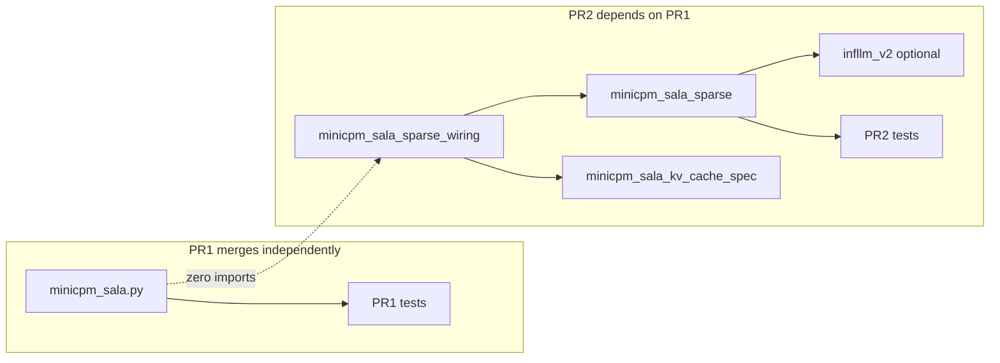

### Scheduler interaction

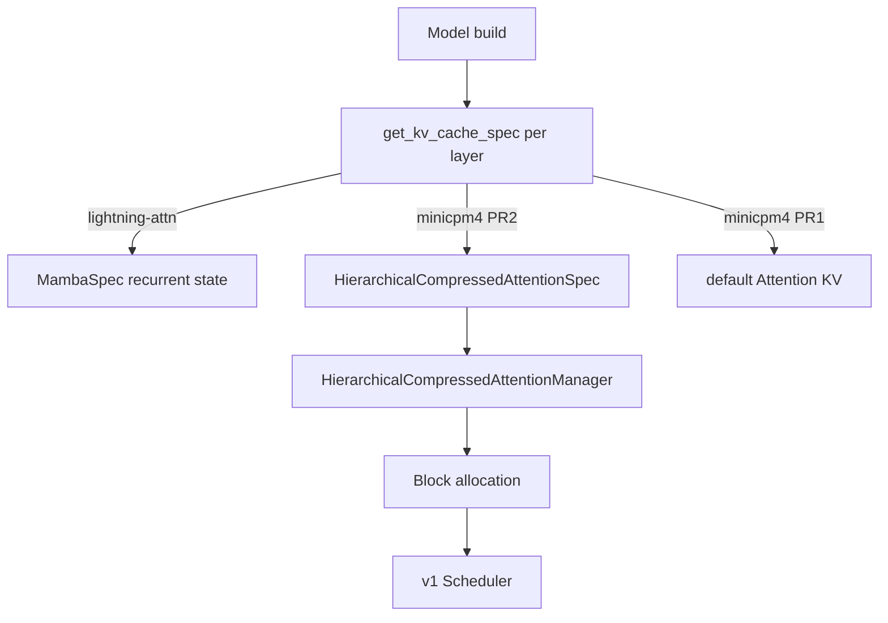

### Memory ownership

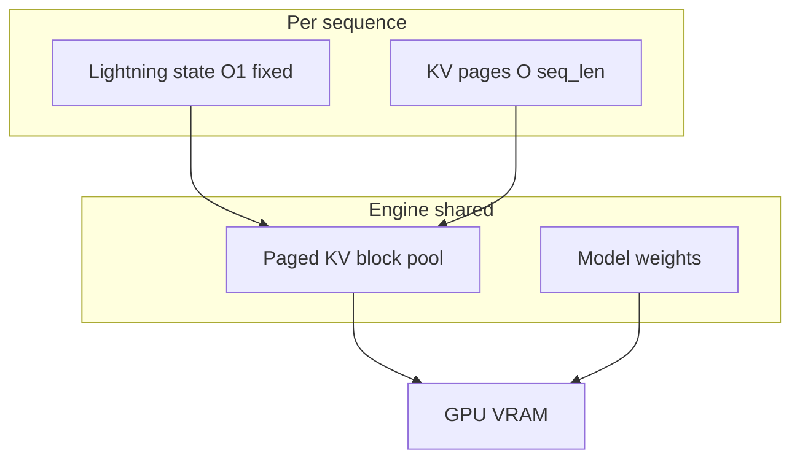

### Token generation flow

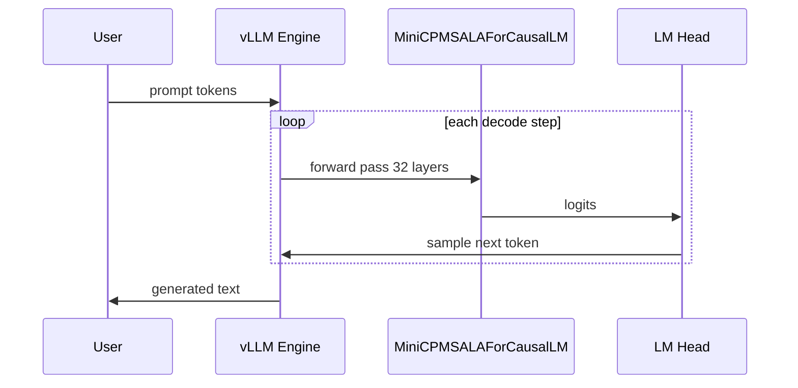

### Weight loading

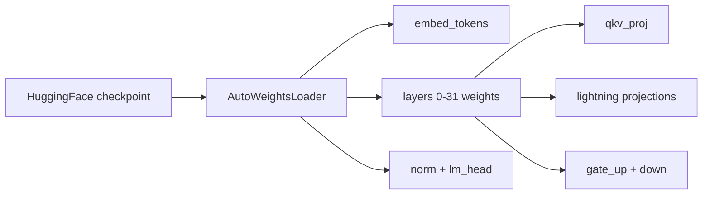

### Configuration loading

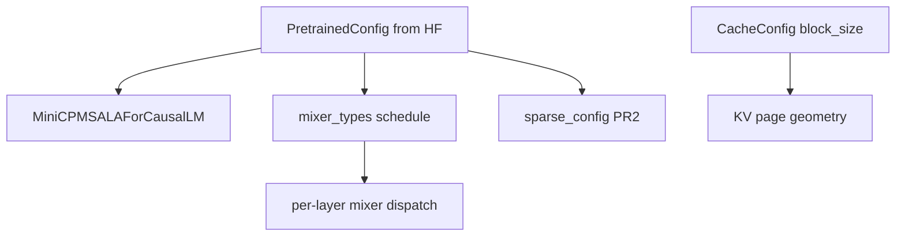

### GPU execution paths

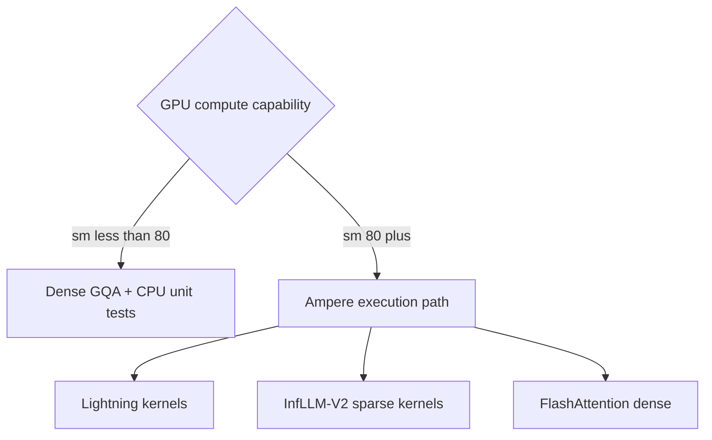

### Repository layout

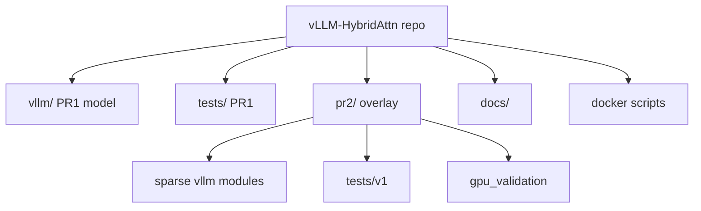

### Docker workflow

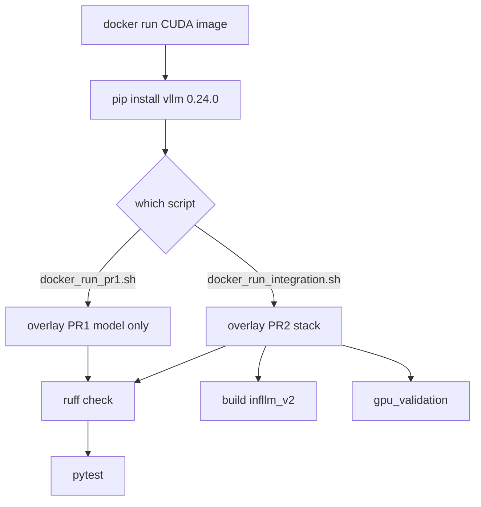

### Testing pipeline

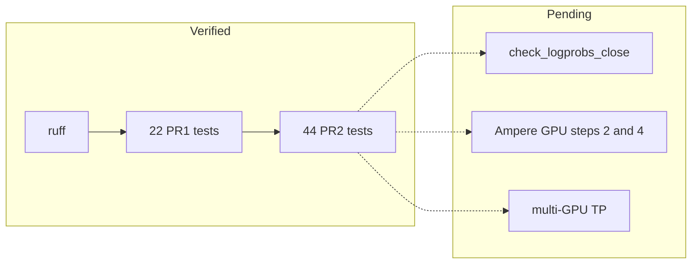

### CI pipeline

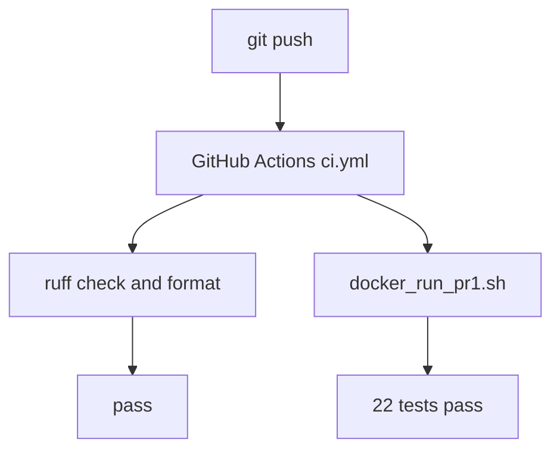

### Upstream PR workflow

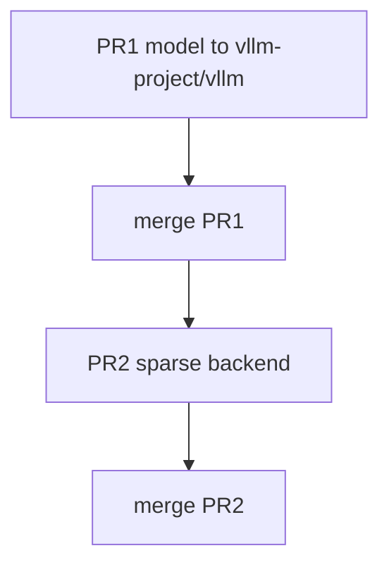

### Git branching strategy

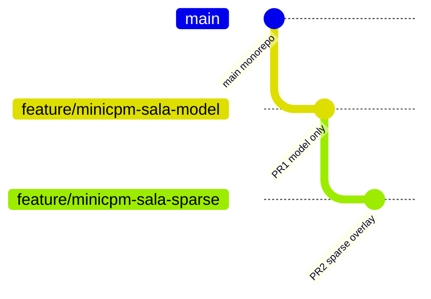
