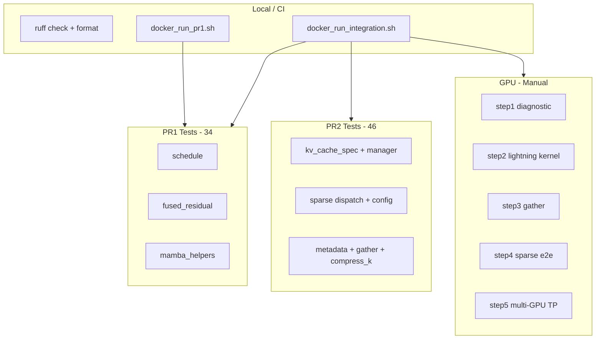

# Testing

## Overview



## Unit tests

### PR1 (`tests/models/language/generation/`)

| File | Count | Scope |
|------|-------|-------|
| `test_minicpm_sala_schedule.py` | 17 | Layer schedule validation |
| `test_minicpm_sala_fused_residual.py` | 4 | Fused residual path |
| `test_minicpm_sala_mamba_helpers.py` | 2 | Mamba state dtype/shape |
| `test_minicpm_sala.py` | 1 | HF logprob parity (**needs GPU + weights**) |

Run PR1 only:

```bash
bash docker_run_pr1.sh
```

### PR2 (`pr2/tests/v1/`)

| Area | Files | Scope |
|------|-------|-------|
| Core | `test_minicpm_sala_kv_cache_spec.py`, `test_minicpm_sala_kv_cache_manager.py`, `test_minicpm_sala_scheduler_spec.py` | KV spec, manager, scheduler wiring |
| Attention | `test_minicpm_sala_*.py` (6 files) | Sparse config, dispatch, metadata, gather, compress_k, block_size |

Run full stack:

```bash
bash docker_run_integration.sh
```

**Verified:** 66/66 pass in Docker (2026-07-03).

## Static analysis

```bash
ruff check vllm/model_executor/models/minicpm_sala.py pr2/vllm/
ruff format --check vllm/model_executor/models/minicpm_sala.py pr2/vllm/
```

**Verified:** pass (2026-07-03).

## Docker gates

| Script | Overlay | Tests |
|--------|---------|-------|
| `docker_run_pr1.sh` | PR1 model only | 22 |
| `docker_run_integration.sh` | PR2 merged stack | 66 + infllm_v2 build + GPU suite |

Both scripts install `vllm==0.24.0` and copy overlay files into site-packages.

## GPU validation (`pr2/scripts/gpu_validation/`)

| Step | Requires GPU | Requires Ampere | Verified on T1000 |
|------|--------------|-----------------|-------------------|
| step1_diagnostic | Optional | No | **Pass** |
| step2_kernel_dispatch | Yes | **Yes** | Fail (sm_75) |
| step3_real_gather_test | Yes | No | **Pass** |
| step4_sparse_e2e_test | Yes | **Yes** | Fail (sm_75) |
| step5_multi_gpu_tp_test | 2+ GPUs | Yes | Skipped |

```bash
bash pr2/scripts/gpu_validation/run_all_gpu_validation.sh
# Multi-GPU: MULTI_GPU_NPROC=2 bash pr2/scripts/gpu_validation/run_all_gpu_validation.sh
```

## HF parity

`test_minicpm_sala.py` uses `check_logprobs_close` against HuggingFace
reference outputs. **Not yet executed** — requires CUDA GPU and downloaded
MiniCPM-SALA weights (~19GB).

## Status summary

| Category | Status |
|----------|--------|
| PR1 unit tests | **Done** |
| PR2 unit tests | **Done** |
| Static analysis | **Done** |
| Docker CI | **Done** |
| T1000 partial GPU | **Done** |
| Ampere+ GPU | **Pending** |
| HF parity | **Pending** |
| Multi-GPU | **Pending** |
